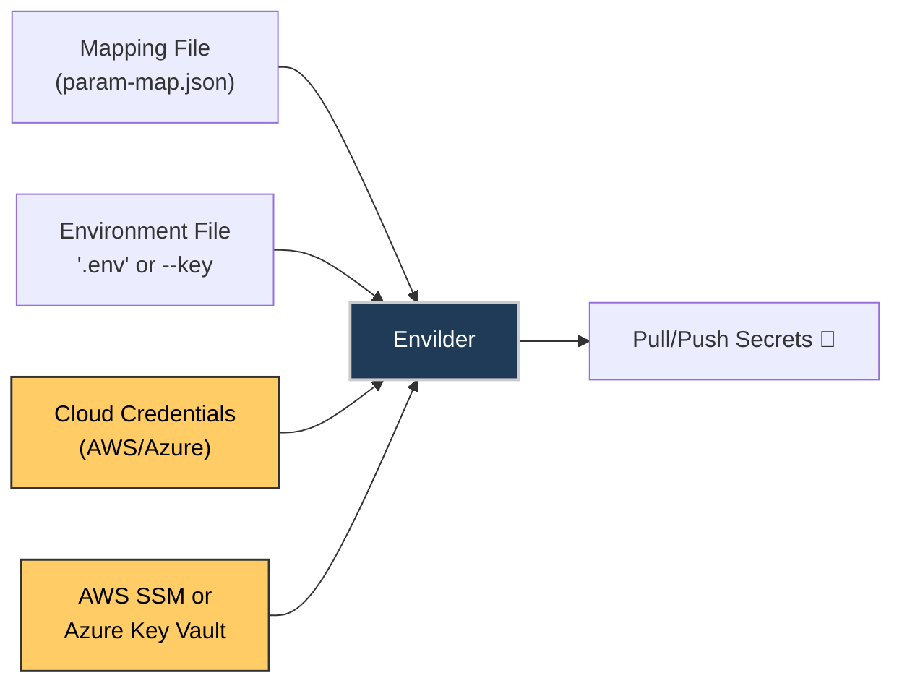

# 🗝️ Envilder ☁️

<p align="center">
  
</p>

<p align="center">
  <b>Automate .env and secret management with Envilder</b><br>
  <span>Streamline your environment setup with AWS Parameter Store and Azure Key Vault</span>
</p>

<p align="center">
  <a href="https://www.npmjs.com/package/envilder">
    
  </a>
  <a href="https://img.shields.io/npm/dm/envilder.svg">
    
  </a>
  <a href="https://github.com/macalbert/envilder/actions/workflows/tests.yml">
    
  </a>
  <a href="https://macalbert.github.io/envilder/">
    
  </a>
  <a href="https://snyk.io/test/github/macalbert/envilder">
    
  </a>
  <a href="./LICENSE">
    
  </a>
</p>

## Why centralize environment variables?

Envilder is a CLI tool for .env automation, cloud secrets management, and secure environment variable sync
across AWS and Azure. Generating and maintaining consistent .env files is a real pain point for any development
team. From outdated secrets to insecure practices, the risks are tangible. Envilder eliminates these pitfalls
by centralizing and automating secret management across real-world environments (dev, test, production) in a
simple, secure, and efficient way. Use Envilder to automate .env files, sync secrets with AWS Parameter Store
or Azure Key Vault, and streamline onboarding and CI/CD workflows.

---

## ❗ What Envilder solves

- Desync between environments (dev, prod)
- Secrets not properly propagated across team members
- CI/CD pipeline failures due to outdated or missing .env files
- Slow and manual onboarding processes
- Security risks from sharing secrets via Slack, email, or other channels
- Insecure .env practices and manual secret sharing

## ✅ How Envilder makes life easier

- 🛡️ Centralizes secrets in AWS Parameter Store or Azure Key Vault
- ☁️ Multi-cloud support: works with both AWS and Azure
- ⚙️ Generates .env files automatically for every environment
- 🔄 Applies changes idempotently and instantly
- 🔐 Improves security: no need to share secrets manually; everything is managed via cloud providers
- 👥 Simplifies onboarding and internal rotations
- 🚀 Enables cloud-native, infrastructure-as-code secret management
- 🤖 Perfect for DevOps, CI/CD, and team sync

---

## 📚 Table of Contents

- [🗝️ Envilder ☁️](#️-envilder-️)
  - [Why centralize environment variables?](#why-centralize-environment-variables)
  - [❗ What Envilder solves](#-what-envilder-solves)
  - [✅ How Envilder makes life easier](#-how-envilder-makes-life-easier)
  - [📚 Table of Contents](#-table-of-contents)
  - [⚙️ Features](#️-features)
    - [🧱 Feature Status](#-feature-status)
  - [💾 Installation](#-installation)
  - [🚀 Quick Start](#-quick-start)
    - [🎥 Video Demonstration](#-video-demonstration)
    - [🏁 Get Started (3 steps)](#-get-started-3-steps)
      - [AWS Setup (Quick - \< 1 minute)](#aws-setup-quick----1-minute)
      - [Azure Setup (Requires Key Vault)](#azure-setup-requires-key-vault)
    - [📚 Quick Links](#-quick-links)
  - [🛠️ How it works](#️-how-it-works)
  - [Frequently Asked Questions (FAQ)](#frequently-asked-questions-faq)
  - [🏁 Roadmap](#-roadmap)
  - [🤝 Contributing](#-contributing)
  - [📜 License](#-license)

---

## ⚙️ Features

- 🔒 **Strict access control** — IAM policies (AWS) or RBAC/Access Policies (Azure) define access across stages
- 📊 **Auditable** — All reads/writes are logged (CloudTrail for AWS, Monitor for Azure)
- 🧩 **Single source of truth** — No more Notion, emails or copy/paste of envs
- 🔁 **Idempotent sync** — Only what's in your map gets updated. Nothing else is touched
- 🧱 **Zero infrastructure** — Fully based on native cloud services. No Lambdas, no servers, no fuss
- ☁️ **Multi-cloud** — Works with AWS SSM Parameter Store and Azure Key Vault

### 🧱 Feature Status

| Feature | Status | Notes |
|--|--|--|
| Mapping-based resolution | ✅ Implemented | |
| `.env` file generation | ✅ Implemented | |
| AWS SSM Parameter Store | ✅ Implemented | Default provider |
| Azure Key Vault | ✅ Implemented | Use `--provider azure` |
| AWS profile support | ✅ Implemented | `--profile` flag |
| Import/push mode (`--push`) | ✅ Implemented | |
| Auto-discovery (`--auto`) | ❌ Planned | Detect keys based on env |
| Check/sync mode (`--check`) | ❌ Planned | Diff local vs remote |
| Webhook/Slack notification | ❌ Planned | On push/pull events |
| Hierarchical mapping | ❌ Not yet | Flat mapping only |
| Plugin system | ❌ Not yet | AWS & Azure only |

---

## 💾 Installation

🛠 Requirements:

- Node.js **v20+** (cloud-native compatible)
- **For AWS:** AWS CLI installed and configured with IAM permissions (`ssm:GetParameter`, `ssm:PutParameter`)
- **For Azure:** Azure CLI installed and configured with a Key Vault instance

```bash
npm install -g envilder
```

> 💡 **Cloud Provider Setup:**
>
> **AWS (ready immediately):**
>
> - [AWS SSM Parameter Store Overview](https://docs.aws.amazon.com/systems-manager/latest/userguide/systems-manager-parameter-store.html)
> - [Setting up AWS CLI credentials](https://docs.aws.amazon.com/cli/latest/userguide/cli-configure-files.html)
> - [IAM permissions for SSM](https://docs.aws.amazon.com/systems-manager/latest/userguide/setup-instance-profile.html)
>
> **Azure (requires setup):**
>
> - [Azure Key Vault Setup Guide](docs/azure-setup.md) ⭐ **Complete 2025 guide**
> - [Azure Key Vault Overview](https://learn.microsoft.com/en-us/azure/key-vault/general/overview)
> - **Note:** Unlike AWS SSM, you must create an Azure Key Vault instance before using Envilder

---

## 🚀 Quick Start

### 🎥 Video Demonstration

Watch how easy it is to automate your .env management in less than 1 minute:  


### 🏁 Get Started (3 steps)

#### AWS Setup (Quick - < 1 minute)

After configuring the AWS CLI and ensuring you have the necessary permissions to create SSM parameters,
you can begin pushing your first environment variables.

1. **Create a mapping file:**

   ```json
   {
     "DB_PASSWORD": "/my-app/db/password"
   }
   ```

2. **Push a secret to AWS SSM:**

   ```bash
   envilder --key=DB_PASSWORD --value=12345 --ssm-path=/my-app/db/password --push
   ```

3. **Generate your .env file from AWS SSM:**

   ```bash
   envilder --map=param-map.json --envfile=.env
   ```

#### Azure Setup (Requires Key Vault)

1. **Follow the [Azure Setup Guide](docs/azure-setup.md)** to create your Key Vault (~5 minutes)

2. **Push a secret to Azure Key Vault:**

   ```bash
   envilder --provider azure --key=DB_PASSWORD --value=12345 --ssm-path=/my-app/db/password --push
   ```

3. **Generate your .env file from Azure Key Vault:**

   ```bash
   envilder --provider azure --map=param-map.json --envfile=.env
   ```

Your secrets are now managed and versioned from the cloud. Add `.env` to your `.gitignore` for security.
Envilder is designed for automation, onboarding, and secure cloud-native workflows.

### 📚 Quick Links

- [Requirements & Installation](docs/requirements-installation.md)
- [Azure Key Vault Setup Guide](docs/azure-setup.md) ⭐ **New!**
- [Push Command Guide](docs/push-command.md)
- [Pull Command Guide](docs/pull-command.md)

---

## 🛠️ How it works



1. Create a new `.env` file like `'ENV_VAR=12345'`
2. Define mappings in a JSON file : `{"ENV_VAR": "ssm/path"}`
3. Run Envilder: `--push` to upload, or `--map` + `--envfile` to generate
4. Envilder syncs secrets securely with your cloud provider (AWS SSM or Azure Key Vault)
5. Result: your secrets are always up-to-date, secure, and ready for any environment

---

## Frequently Asked Questions (FAQ)

**Q: What is Envilder?**  
A: Envilder is a CLI tool for automating .env and secret management using AWS SSM Parameter Store or Azure Key Vault.

**Q: Which cloud providers are supported?**  
A: AWS SSM Parameter Store (default) and Azure Key Vault (use `--provider azure` flag).

**Q: How does Envilder improve security?**  
A: Secrets are never stored in code or shared via chat/email. All secrets are managed and synced securely via cloud providers.

**Q: Can I use Envilder in CI/CD pipelines?**  
A: Yes! Envilder is designed for automation and works seamlessly in CI/CD workflows on both AWS and Azure.

**Q: Does Envilder support multiple AWS profiles?**  
A: Yes, you can use the `--profile` flag to select different AWS credentials.

**Q: Do I need to create anything in Azure before using Envilder?**  
A: Yes, unlike AWS SSM (which is available by default), you must create an Azure Key Vault instance first.
See our [Azure Setup Guide](docs/azure-setup.md).

**Q: What environments does Envilder support?**  
A: Any environment supported by your cloud provider—dev, test, staging, production, etc.

**Q: Is Envilder open source?**  
A: Yes, licensed under MIT.

---

## 🏁 Roadmap

🧭 Planned features:

- 🔍 Drift detection (`--check`)
- 🧠 Auto-discovery (`--auto`)
- 📨 Slack/Webhook notifications
- 🔌 Plugin system (Vault, Secrets Manager, etc.)

👉 See full [ROADMAP.md](./ROADMAP.md)

---

## 🤝 Contributing

All help is welcome — PRs, issues, ideas!

- 🔧 Use our [Pull Request Template](.github/pull_request_template.md)
- 🧪 Add tests where possible
- 💬 Feedback and discussion welcome

---

## 📜 License

MIT © [Marçal Albert](https://github.com/macalbert)
See [LICENSE](./LICENSE)
