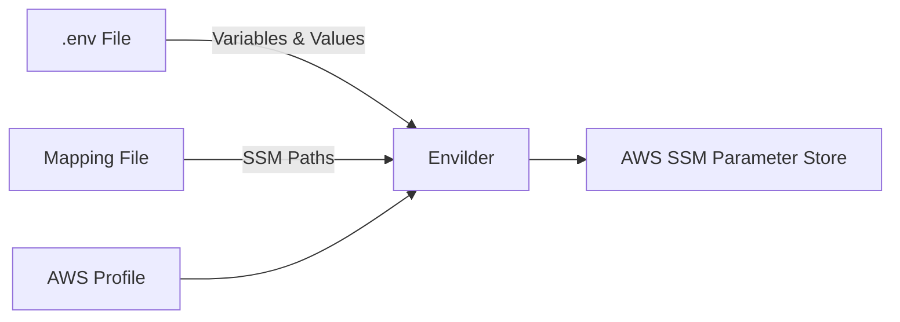
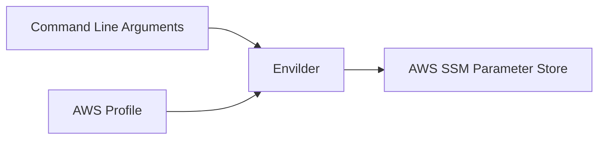

# 🗝️ Envilder ☁️

<p align="center">
  
</p>
</p>

<p align="center">
  <b>✨ A CLI that securely centralizes your environment variables from AWS SSM as a single source of truth ✨</b>
</p>

<p align="center">
  <a href="https://www.npmjs.com/package/envilder">
    
  </a>
  <a href="./LICENSE">
    
  </a>
  <a href="https://macalbert.github.io/envilder/">
    
  </a>
</p>

---

## 🎥 Video Demonstration

Watch how Envilder works in less than 1 minute:  


---

## 📚 Table of Contents

- [🗝️ Envilder ☁️](#️-envilder-️)
  - [🎥 Video Demonstration](#-video-demonstration)
  - [📚 Table of Contents](#-table-of-contents)
  - [⚙️ Features](#️-features)
    - [🧱 Feature Status](#-feature-status)
  - [💾 Installation](#-installation)
  - [🚀 Quick Start](#-quick-start)
  - [🛠️ How It Works](#️-how-it-works)
  - [🎮 Usage](#-usage)
    - [🚀 Push Mode (`--push`)](#-push-mode---push)
      - [🍄 Method 1: Push from .env File](#-method-1-push-from-env-file)
    - [⭐ Method 2: Push a Single Variable](#-method-2-push-a-single-variable)
    - [🧰 Push Mode Options Summary](#-push-mode-options-summary)
    - [🧪 Push Mode Examples](#-push-mode-examples)
    - [⬇️ Pull Mode (`--map` and `--envfile`)](#️-pull-mode---map-and---envfile)
      - [⚙️ Pull Mode Options](#️-pull-mode-options)
      - [🧪 Pull Mode Examples](#-pull-mode-examples)
      - [📜 Sample Output](#-sample-output)
  - [👥 Working with Multiple AWS Profiles](#-working-with-multiple-aws-profiles)
    - [⬇️ Pull Mode Example](#️-pull-mode-example)
    - [🚀 Push Mode Example](#-push-mode-example)
  - [🏁 Roadmap](#-roadmap)
  - [🤝 Contributing](#-contributing)
  - [📜 License](#-license)

---

## ⚙️ Features

- 🔒 **Strict access control** — IAM policies define access to secrets across stages (dev, staging, prod)
- 📊 **Auditable** — All reads/writes are logged in AWS CloudTrail
- 🧩 **Single source of truth** — No more Notion, emails or copy/paste of envs
- 🔁 **Idempotent sync** — Only what’s in your map gets updated. Nothing else is touched
- 🧱 **Zero infrastructure** — Fully based on native AWS SSM. No Lambdas, no servers, no fuss

### 🧱 Feature Status

| Feature | Status | Notes |
|--|--|--|
| Mapping-based resolution | ✅ Implemented | |
| `.env` file generation | ✅ Implemented | |
| AWS profile support | ✅ Implemented | `--profile` flag |
| Import/push mode (`--push`) | ✅ Implemented | |
| Auto-discovery (`--auto`) | ❌ Planned | Detect keys based on env |
| Check/sync mode (`--check`) | ❌ Planned | Diff local vs remote |
| Webhook/Slack notification | ❌ Planned | On push/pull events |
| Hierarchical mapping | ❌ Not yet | Flat mapping only |
| Plugin system | ❌ Not yet | SSM is the only backend (for now) |

---

## 💾 Installation

🛠 Requirements:

- Node.js **v20+**
- AWS CLI installed and configured
- IAM user/role with `ssm:GetParameter`, `ssm:PutParameter`

```bash
npm install -g envilder
```

---

## 🚀 Quick Start

Get started with **Envilder** in 3 simple steps. Remember to add `.env` to your `.gitignore` file for security.

Initial Setup

```bash
# Step 1: Create a parameter mapping file
echo '{
  "DB_PASSWORD": "/my-app/db/password"
}' > param-map.json

# Step 2: Push a secret to AWS SSM Parameter Store
envilder --push --key=DB_PASSWORD --value=12345 --ssm-path=/my-app/db/password
```

Ongoing Usage

```bash
# Step 3: Generate your .env file from AWS SSM
envilder --map=param-map.json --envfile=.env
```

🎯 That’s it — your secrets are now managed and versioned from AWS SSM.

---

## 🛠️ How It Works

```mermaid
graph LR
    A[Mapping File (param-map.json)] --> B[Envilder]
    C[.env File or --key] --> B
    D[AWS Credentials] --> B
    E[AWS SSM] --> B
    B --> F[Pull/Push Secrets 💾]
```

1. Define mappings in JSON: `{"ENV_VAR": "ssm/path"}`
2. Run Envilder: `--push` to upload, or `--map` + `--envfile` to generate
3. It talks to SSM using your AWS credentials
4. Result: your secrets synced ✅

---

## 🎮 Usage

### 🚀 Push Mode (`--push`)

Push Mode uploads environment variables to AWS SSM Parameter Store. It has two distinct operation methods:

#### 🍄 Method 1: Push from .env File

**Requirements:**

- `--push` flag to enable Push Mode
- `--envfile` pointing to your local .env file
- `--map` pointing to your parameter mapping JSON file

**How File-Based Push Works:**

1. Envilder reads your local `.env` file to get variable names and values
2. Envilder reads your `map` file to find the corresponding SSM paths
3. For each variable found in both files, Envilder pushes the value to AWS SSM
4. No modifications are made to your local files



**Example:**
If your `.env` file contains:

```text
API_KEY=abc123
DB_PASSWORD=secret456
```

And your `param-map.json` file contains:

```json
{
  "API_KEY": "/myapp/api/key",
  "DB_PASSWORD": "/myapp/db/password"
}
```

Running this command:

```bash
envilder --push --envfile=.env --map=param-map.json
```

Will push:

- Value `abc123` to SSM path `/myapp/api/key`
- Value `secret456` to SSM path `/myapp/db/password`

### ⭐ Method 2: Push a Single Variable

**What it does:**
Uploads a single environment variable directly to AWS SSM Parameter Store without using any files.

**Required parameters:**

- `--push`: Activates Push Mode
- `--key=VAR_NAME`: The name of the environment variable
- `--value=secret123`: The value to store in AWS SSM
- `--ssm-path=/your/path`: The full AWS SSM parameter path

**Important notes:**

- NO files are read or modified
- This is a direct command-to-SSM operation
- Useful for quick updates or CI/CD pipelines



**Example:**

```bash
envilder --push --key=API_KEY --value=abc123 --ssm-path=/myapp/api/key
```

Will push:

- Value `abc123` to SSM path `/myapp/api/key`

### 🧰 Push Mode Options Summary

**Common Options:**

| Option       | Description                        |
|------------- | ---------------------------------- |
| `--push`     | Required: Enables push mode        |
| `--profile`  | Optional: AWS CLI profile to use   |

**Method 1: File-Based Push Options:**

| Option       | Description                                        |
|------------- | -------------------------------------------------- |
| `--envfile`  | Required: Path to your local .env file             |
| `--map`      | Required: Path to your parameter mapping JSON file |

**Method 2: Single-Variable Push Options:**

| Option       | Description                                 |
|------------- | ------------------------------------------- |
| `--key`      | Required: Environment variable name         |
| `--value`    | Required: Value to store in AWS SSM         |
| `--ssm-path` | Required: Full SSM parameter path           |

### 🧪 Push Mode Examples

**Method 1: Push from .env file (multiple variables at once):**

```bash
# Basic usage - pushes all variables found in both .env and map files
envilder --push --envfile=.env --map=param-map.json

# With AWS profile - for different environments
envilder --push --envfile=.env.prod --map=param-map.json --profile=prod-account
```

**Method 2: Push a single variable (no files needed):**

```bash
# Basic usage - pushes one variable directly to SSM
envilder --push --key=API_KEY --value=secret123 --ssm-path=/my/path

# With AWS profile
envilder --push --key=API_KEY --value=secret123 --ssm-path=/my/path --profile=dev
```

---

### ⬇️ Pull Mode (`--map` and `--envfile`)

Downloads secrets from SSM and writes to `.env`.

#### ⚙️ Pull Mode Options

| Option      | Description                         |
| ----------- | ----------------------------------- |
| `--map`     | JSON mapping of env var to SSM path |
| `--envfile` | Path to write `.env`                |
| `--profile` | AWS profile to use                  |

#### 🧪 Pull Mode Examples

```bash
envilder --map=param-map.json --envfile=.env
```

With profile:

```bash
envilder --map=param-map.json --envfile=.env --profile=dev-account
```

#### 📜 Sample Output

After running the pull command above with a `param-map.json` file containing:

```json
{
  "API_KEY": "/myapp/api/key",
  "DB_PASSWORD": "/myapp/db/password",
  "SECRET_TOKEN": "/myapp/auth/token"
}
```

Your generated `.env` file would look like:

```dotenv
# Generated by Envilder on 2025-07-13
API_KEY=abc123
DB_PASSWORD=secret456
SECRET_TOKEN=eyJhbGciOiJIUzI1NiIsInR5cCI6IkpXVCJ9
```

This keeps your sensitive values secure in AWS SSM while providing local access for development.

---

## 👥 Working with Multiple AWS Profiles

Edit your `~/.aws/credentials`:

```ini
[default]
aws_access_key_id=DEFAULT_KEY
aws_secret_access_key=DEFAULT_SECRET

[dev-account]
aws_access_key_id=DEV_KEY
aws_secret_access_key=DEV_SECRET

[prod-account]
aws_access_key_id=PROD_KEY
aws_secret_access_key=PROD_SECRET
```

---

### ⬇️ Pull Mode Example

```bash
# Default
envilder --map=param-map.json --envfile=.env.dev

# Development
envilder --map=param-map.json --envfile=.env.dev --profile=dev-account

# Production
envilder --map=param-map.json --envfile=.env.prod --profile=prod-account
```

---

### 🚀 Push Mode Example

```bash
# Default
envilder --push --key=API_KEY --value=secret123 --ssm-path=/dev/api/key

# Development
envilder --push --key=API_KEY --value=secret123 --ssm-path=/dev/api/key --profile=dev-account

# Production
envilder --push --key=API_KEY --value=secret123 --ssm-path=/prod/api/key --profile=prod-account
```

---

## 🏁 Roadmap

🧭 Planned features:

- 🔍 Drift detection (`--check`)
- 🧠 Auto-discovery (`--auto`)
- 📨 Slack/Webhook notifications
- 🔌 Plugin system (Vault, Secrets Manager, etc.)

👉 See full [ROADMAP.md](./ROADMAP.md)

---

## 🤝 Contributing

All help is welcome — PRs, issues, ideas!

- 🔧 Use our [Pull Request Template](.github/pull_request_template.md)
- 🧪 Add tests where possible
- 💬 Feedback and discussion welcome

---

## 📜 License

MIT © [Marçal Albert](https://github.com/macalbert)
See [LICENSE](./LICENSE)

---
