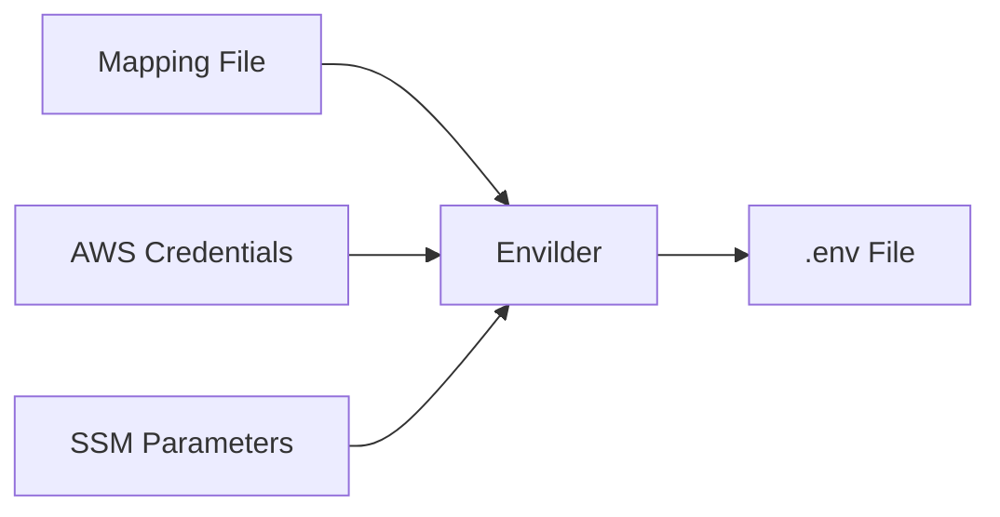

# Envilder

<p align="center">
  
</p>

<p align="center">
  <b>✨ A CLI that securely centralizes your environment variables from AWS SSM as a single source of truth ✨</b>
</p>

<p align="center">
  <a href="https://www.npmjs.com/package/envilder">
    
  </a>
  <a href="./LICENSE">
    
  </a>
  <a href="https://macalbert.github.io/envilder/">
    
  </a>
</p>

---

## Table of contents

- [Envilder](#envilder)
  - [Table of contents](#table-of-contents)
  - [Features](#features)
    - [Feature status](#feature-status)
  - [Quick start 🚀](#quick-start-)
  - [How it works 🛠️](#how-it-works-️)
  - [Installation 💾](#installation-)
  - [Usage](#usage)
    - [Example](#example)
  - [Working with multiple AWS profiles](#working-with-multiple-aws-profiles)
  - [Sample output 📄](#sample-output-)
  - [Roadmap 🗺️](#roadmap-️)
  - [Contributing 🤝](#contributing-)
  - [License 📄](#license-)

---

## Features

- **🔒 Strict access control** — AWS IAM policies control who accesses which secrets (dev vs prod)
- **📊 Full audit trail** — All parameter access is logged in CloudTrail for compliance
- **🧩 Single source of truth** — No more copying .env files from Notion or emails
- **🔁 Idempotent operations** — Only variables in your mapping file are overwritten; others are preserved
- **🧱 No extra infrastructure** — Uses AWS SSM's reliability, no new services needed

### Feature status

| Feature                        | Status         | Notes |
|--------------------------------|---------------|-------|
| Mapping-based secret resolution| ✅ Implemented | |
| .env file generation           | ✅ Implemented | |
| AWS profile support            | ✅ Implemented | |
| Auto-discovery mode (`--auto`) | ❌ Not implemented | Planned |
| Check/sync mode (`--check`)    | ❌ Not implemented | Planned |
| Import/push mode (`--import`)  | ❌ Not implemented | Planned |
| Webhook/Slack notification     | ❌ Not implemented | Planned |
| Hierarchical mapping           | ❌ Not implemented | Only flat JSON mapping supported |
| Plugin system                  | ❌ Not implemented | Only AWS SSM supported |

---

## Quick start 🚀

```bash
npm install -g envilder

echo '{"DB_PASSWORD": "/my-app/db/password"}' > param-map.json

envilder --map=param-map.json --envfile=.env
```

---

## How it works 🛠️



1. **Define your mapping** — Simple JSON mapping env vars to SSM paths
2. **Run Envilder** — One command with your mapping file
3. **Auto-fetch from AWS** — Retrieves values using your AWS credentials
4. **Get your .env file** — Ready to use in your project

---

## Installation 💾

**Requires:** Node.js >= 20.0.0, AWS CLI configured with SSM access

```bash
npm install -g envilder
```

---

## Usage

```bash
envilder --map=<mapping-file> --envfile=<output-file> [--profile=<aws-profile>]
```

| Option      | Description                                 |
|-------------|---------------------------------------------|
| `--map`     | Path to JSON mapping file (required)         |
| `--envfile` | Path to output .env file (required)          |
| `--profile` | AWS CLI profile to use (optional)            |

### Example

1. **Create a parameter in AWS SSM Parameter Store using AWS CLI:**

    ```bash
    aws ssm put-parameter --name "/path/to/ssm/token" --value "my-secret-token-value" --type "SecureString"
    aws ssm put-parameter --name "/path/to/ssm/password" --value "my-secret-password-value" --type "SecureString"
    ```

    You can also create the parameter in a specific profile (for example, `dev-account`):

    ```bash
    aws ssm put-parameter --name "/path/to/ssm/token" --value "my-secret-token-value" --type "SecureString" --profile dev-account
    aws ssm put-parameter --name "/path/to/ssm/password" --value "my-secret-password-value" --type "SecureString" --profile dev-account
    ```

2. Create a mapping file `param-map.json`:

    ```json
    {
      "SECRET_TOKEN": "/path/to/ssm/token",
      "SECRET_KEY": "/path/to/ssm/password"
    }
    ```

3. Generate your `.env` file:

    ```bash
    envilder --map=param-map.json --envfile=.env
    ```

4. Use a specific AWS profile:

    ```bash
    envilder --map=param-map.json --envfile=.env --profile=dev-account
    ```

---

## Working with multiple AWS profiles

Configure different profiles in your AWS credentials file (usually at `~/.aws/credentials` or `%USERPROFILE%\.aws\credentials`):

```ini
[default]
aws_access_key_id=YOUR_DEFAULT_ACCESS_KEY
aws_secret_access_key=YOUR_DEFAULT_SECRET_KEY

[dev-account]
aws_access_key_id=YOUR_DEV_ACCESS_KEY
aws_secret_access_key=YOUR_DEV_SECRET_KEY

[prod-account]
aws_access_key_id=YOUR_PROD_ACCESS_KEY
aws_secret_access_key=YOUR_PROD_SECRET_KEY
```

Specify which profile to use:

```bash
# Development

envilder --map=param-map.json --envfile=.env.development --profile=dev-account

# Production

envilder --map=param-map.json --envfile=.env.production --profile=prod-account
```

---

## Sample output 📄

Example `.env` file generated:

```ini
SECRET_TOKEN=mockedEmail@example.com
SECRET_KEY=mockedPassword
```

---

## Roadmap 🗺️

See [ROADMAP.md](./ROADMAP.md) for planned features and ideas.

---

## Contributing 🤝

Contributions are welcome! Please see the [contributing guidelines](https://github.com/macalbert/envilder/blob/main/.github/pull_request_template.md).

Feel free to open issues or pull requests.

---

## License 📄

MIT © [Marçal Albert](https://github.com/macalbert).

See [LICENSE](./LICENSE) for details.
