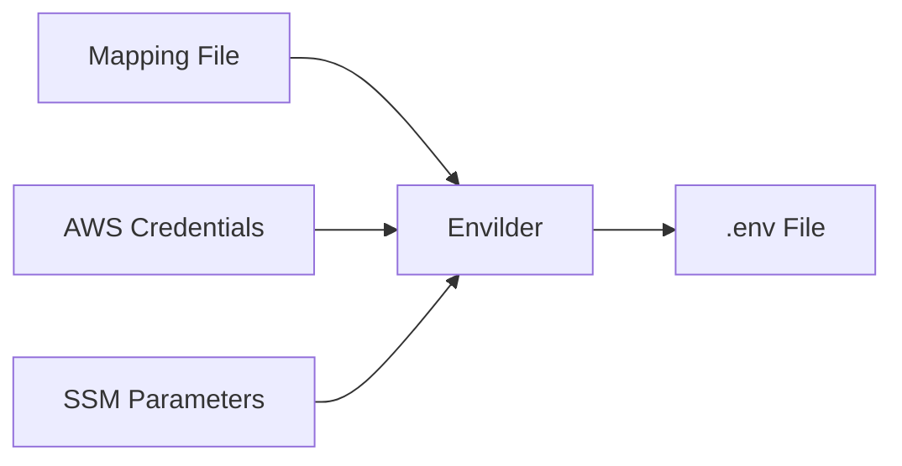

<h1 align="center">
  <br>
  
</h1>

<h4 align="center">A CLI that securely centralizes your environment variables from AWS SSM as a single source of truth</h4>

<p align="center">
  <a href="https://www.npmjs.com/package/envilder">
    
  </a>
  <a href="./LICENSE">
    
  </a>
  <a href="https://macalbert.github.io/envilder/">
    
  </a>
</p>

## 🌟 Key benefits

- **🔒 Strict access control** - AWS IAM policies control who accesses which secrets (dev vs prod)
- **📊 Full audit trail** - All parameter access is logged in CloudTrail for compliance requirements
- **🧩 Single source of truth** - No more copying .env files from Notion or emails - SSM is your only source
- **🔁 Idempotent operations** - Won't overwrite your local values - safe for automation
- **⚙️ Environment-aware** - Use templates like `/project/${ENV}/DB_PASSWORD` to dynamically fetch the right secrets
- **🧱 No extra infrastructure** - Uses AWS SSM's existing reliability instead of additional secret managers

## ⚡ Quick start

```bash
# Install globally
npm install -g envilder

# Create a simple mapping file
echo '{"DB_PASSWORD": "/my-app/db/password"}' > param-map.json

# Generate your .env file
envilder --map=param-map.json --envfile=.env
```

## 🤔 What problem does Envilder solve?

<table>
<tr>
<th>❌ Without Envilder</th>
<th>✅ With Envilder</th>
</tr>
<tr>
<td>

```plaintext
- Secrets committed to repos
- Manual .env file updates
- Inconsistent environments
- Password sharing via chat/email
- CI/CD secrets management pain
```

</td>
<td>

```plaintext
- Secrets stored securely in AWS SSM
- Automated .env file generation
- Consistent environments
- No need to share raw credentials
- Simple CI/CD integration
```

</td>
</tr>
</table>

## 💡 Why Envilder?

- 🔐 **No more secrets in git** - Store credentials in AWS SSM Parameter Store instead of version control
- 🤖 **Automate everything** - One command to generate your `.env` files across all environments
- 🔄 **Always in sync** - Keep your local, dev, and production environments consistent
- 🏎️ **Fast to set up** - Configure once, then generate `.env` files with a single command
- 🪶 **Simple but powerful** - Easy interface with support for encrypted parameters and multiple AWS profiles

## 🎯 Perfect for teams

Envilder is the tool you need if you:

- 👥 **Work in a development team** - Ensure everyone has the same environment without sharing raw secrets
- 🔑 **Deal with API keys & tokens** - Securely store and retrieve sensitive credentials
- ⚙️ **Run CI/CD pipelines** - Automatically generate environment files during deployments
- ☁️ **Use AWS already** - Leverage your existing AWS infrastructure more effectively
- 🌐 **Manage multiple environments** - Switch easily between dev, staging, and production

## 🔍 How it works (simple!)



1. 📖 **Define your mapping** - Simple JSON mapping env vars to SSM paths
2. 🚀 **Run Envilder** - One command with your mapping file
3. 🔄 **Auto-fetch from AWS** - Retrieves values using your AWS credentials
4. 💾 **Get your .env file** - Ready to use in your project

## ⚙️ Prerequisites

You'll need:

- ✅ **AWS CLI** - Installed and configured with proper permissions to access SSM Parameter Store
- ✅ **Node.js** - Version 14 or higher

### AWS CLI setup

1. Install the AWS CLI by following the [official instructions](https://docs.aws.amazon.com/cli/latest/userguide/getting-started-install.html).
2. After installation, configure the AWS CLI:

    ```bash
    aws configure
    ```

    You'll be prompted to provide:
    - AWS Access Key ID
    - AWS Secret Access Key
    - Default region name (e.g., `us-east-1`)
    - Default output format (e.g., `json`)

   Make sure your AWS credentials have the appropriate permissions to access the SSM Parameter Store.

## 📦 Installation

```bash
# Using npm
npm install -g envilder

# Using yarn
yarn global add envilder
```

## 🚀 Usage

```bash
envilder --map=<mapping-file> --envfile=<output-file> [--profile=<aws-profile>]
```

| Option | Description |
|--------|-------------|
| `--map` | Path to JSON mapping file (required) |
| `--envfile` | Path to output .env file (required) |
| `--profile` | AWS CLI profile to use (optional) |

## 🔧 Quick example

1. Create a mapping file `param-map.json`:

    ```json
    {
      "SECRET_TOKEN": "/path/to/ssm/token",
      "SECRET_KEY": "/path/to/ssm/password"
    }
    ```

2. Generate your `.env` file:

    ```bash
    envilder --map=param-map.json --envfile=.env
    ```

3. Use a specific AWS profile:

    ```bash
    envilder --map=param-map.json --envfile=.env --profile=dev-account
    ```

## 🌐 Working with multiple AWS profiles

For multiple AWS accounts or environments, configure different profiles in your AWS credentials file:

1. Edit your AWS credentials file (typically located at `~/.aws/credentials` on Linux/Mac
or `%USERPROFILE%\.aws\credentials` on Windows):

    ```ini
    [default]
    aws_access_key_id=YOUR_DEFAULT_ACCESS_KEY
    aws_secret_access_key=YOUR_DEFAULT_SECRET_KEY

    [dev-account]
    aws_access_key_id=YOUR_DEV_ACCESS_KEY
    aws_secret_access_key=YOUR_DEV_SECRET_KEY

    [prod-account]
    aws_access_key_id=YOUR_PROD_ACCESS_KEY
    aws_secret_access_key=YOUR_PROD_SECRET_KEY
    ```

2. Specify which profile to use:

    ```bash
    # Development environment
    envilder --map=param-map.json --envfile=.env.development --profile=dev-account

    # Production environment
    envilder --map=param-map.json --envfile=.env.production --profile=prod-account
    ```

## 🛠️ Advanced usage: environment-specific parameters

Envilder works brilliantly with environment variables for dynamic parameter paths:

1. Set up your SSM parameters with environment-specific paths:

   ```text
   /project/dev/DB_PASSWORD
   /project/stage/DB_PASSWORD
   /project/prod/DB_PASSWORD
   ```

2. Create a template-based mapping file `env-map.json`:

   ```json
   {
     "DB_PASSWORD": "/project/${ENV}/DB_PASSWORD"
   }
   ```

3. Generate environment-specific .env files:

   ```powershell
   # Development
   $env:ENV = "dev"
   envilder --map=env-map.json --envfile=.env.dev

   # Staging 
   $env:ENV = "stage"
   envilder --map=env-map.json --envfile=.env.stage
   
   # Production
   $env:ENV = "prod" 
   envilder --map=env-map.json --envfile=.env.prod --profile=prod-account
   ```

This approach ensures the right variables are pulled for each environment with minimal configuration.

## 📂 Sample `.env` output

```ini
SECRET_TOKEN=mockedEmail@example.com
SECRET_KEY=mockedPassword
```

## 🎯 Why use Envilder in practice?

Envilder eliminates common problems in development teams:

- **🛑 No more "it works on my machine"** - Everyone uses the exact same environment variables from the same source
- **🔄 Always fresh credentials** - Update a secret in SSM and everyone gets it automatically on next run
- **🛡️ Access control built-in** - Developers only see dev secrets, CI/CD systems see what they need
- **🧠 Zero mental overhead** - No need to remember which variables are needed - the mapping defines everything
- **🚫 No more sharing secrets** - Stop pasting credentials in Slack, email, or Notion documents
- **📋 Compliance ready** - All accesses are logged in AWS CloudTrail for auditing

## 🧪 Running tests

```bash
yarn test
```

Check the current coverage report: [Coverage Report](https://macalbert.github.io/envilder/)

## 📝 License

This project is licensed under the MIT License - see the [LICENSE](./LICENSE) file for details.

## 🙌 Contributing

Contributions are welcome! Feel free to submit issues and pull requests.
