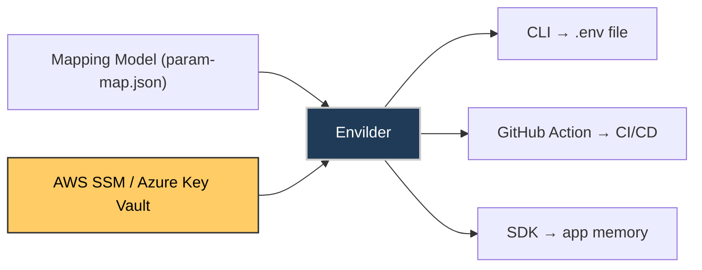

# 🗝️ Envilder ☁️

<p align="center">
  
</p>

<p align="center">
  <b>One model. Your secrets. Every runtime.</b><br>
  <span>Define secret mappings once. Resolve them consistently from AWS SSM or Azure Key Vault.</span>
</p>

[](https://www.npmjs.com/package/envilder)
[](https://npmcharts.com/compare/envilder)
[](https://github.com/macalbert/envilder/actions/workflows/tests.yml)
[](https://macalbert.github.io/envilder/)
[](./LICENSE)

## Why Envilder?

Your new developer joins the team. They need environment variables to run the app locally.
What happens next? Someone sends API keys over Slack. Someone else digs up a wiki page
with outdated credentials. Forty-five minutes later, their `.env` file is "probably correct".

**Envilder fixes this in one command.**

You create a JSON mapping between variable names and cloud secret paths. Envilder resolves
them from AWS SSM or Azure Key Vault. The same mapping file works in local dev (CLI),
CI/CD (GitHub Action), and application startup (runtime SDKs).

```bash
envilder --map=param-map.json --envfile=.env
```

No SaaS middleman. No vendor lock-in. Secrets stay in your cloud.

---

## The problem

- **Onboarding takes hours, not seconds.** Every new developer needs someone to explain which
  secrets go where. Keys get shared over Slack, pasted from wikis, or copied from a colleague's
  machine. It's slow, error-prone, and insecure.
- **Every environment has its own workflow.** Local dev reads `.env` files. CI/CD uses vault
  integrations. Production has its own method. Same app, three different secret workflows.
- **No single source of truth.** Without a versioned contract, dev/staging/production configs
  drift apart. Deployments break. Nobody knows which config is correct.

## How Envilder solves it

- 📋 **One mapping file for everything.** A single `param-map.json` defines what secrets your app
  needs. Git-versioned, PR-reviewable, the same across every environment.
- ⚡ **Works everywhere your code runs.** CLI for local dev, GitHub Action for CI/CD, runtime SDKs
  for application startup. Same file, same result.
- 🛡️ **Your cloud, zero infrastructure.** Secrets stay in AWS SSM or Azure Key Vault. No SaaS
  proxy, no extra servers, no data to migrate.

---

## ⚙️ Features

| Feature | Description |
|---------|-------------|
| 📋 **Declarative Mapping** | One JSON file defines all secrets. Git-versioned, PR-reviewable, diff-able |
| ☁️ **Multi-Provider** | AWS SSM + Azure Key Vault. No vendor lock-in |
| 🔌 **Runtime SDKs** | Load secrets into memory at app startup: [.NET](./src/sdks/dotnet/README.md), [Python](./src/sdks/python/README.md). No `.env` on disk |
| ⚙️ **GitHub Action** | Pull secrets in CI/CD. Same mapping, zero manual config |
| 🔄 **Bidirectional Sync** | Pull secrets to `.env` or push values back to the cloud |
| 🧱 **Zero Infrastructure** | No servers, no proxies, no SaaS. Uses cloud services you already have |

---

## 🚀 Quick Start

### 🎥 See it in action

Watch how easy it is to automate your .env management in less than 1 minute:  


### 🏁 Get Started (2 steps)

**1. Create a mapping file** (`param-map.json`):

```json
{
  "DB_PASSWORD": "/my-app/db/password",
  "API_KEY": "/my-app/api-key"
}
```

**2. Generate your `.env` file:**

```bash
npx envilder --map=param-map.json --envfile=.env
```

That's it. Your secrets are pulled from AWS SSM and written to `.env`.
Add `.env` to `.gitignore`. The mapping file is versioned and reviewable in PRs.

> 💡 Using Azure Key Vault? Add a `$config` section to your mapping file.
> See [Mapping File Format](#️-mapping-file-format) below.

### 💾 Installation

```bash
npm install -g envilder
```

> 💡 **No install needed?** `npx envilder` works out of the box.
>
> **Requirements:** Node.js v20+. AWS CLI or Azure CLI configured.
> See [full requirements](docs/requirements-installation.md).

### 🤖 GitHub Action

**AWS SSM (default):**

```yaml
- name: Configure AWS Credentials
  uses: aws-actions/configure-aws-credentials@v5
  with:
    role-to-assume: ${{ secrets.AWS_ROLE_TO_ASSUME }}
    aws-region: us-east-1

- name: Pull secrets from AWS SSM
  uses: macalbert/envilder/github-action@v0.8.0
  with:
    map-file: param-map.json
    env-file: .env
```

**Azure Key Vault:**

```yaml
- name: Azure Login
  uses: azure/login@v2
  with:
    client-id: ${{ secrets.AZURE_CLIENT_ID }}
    tenant-id: ${{ secrets.AZURE_TENANT_ID }}
    subscription-id: ${{ secrets.AZURE_SUBSCRIPTION_ID }}

- name: Pull secrets from Azure Key Vault
  uses: macalbert/envilder/github-action@v0.8.0
  with:
    map-file: param-map.json
    env-file: .env
    provider: azure
    vault-url: ${{ secrets.AZURE_KEY_VAULT_URL }}
```

📖 **[Full GitHub Action docs](./github-action/README.md)**

### 📚 More resources

- [📖 Full Documentation](https://envilder.com): the complete guide at envilder.com
- [Push Command Guide](docs/push-command.md)
- [Pull Command Guide](docs/pull-command.md)

---

## 🗺️ Mapping File Format

The mapping file (`param-map.json`) is the core of Envilder. It's the single model that defines
what secrets your app needs and where they live in your cloud provider. The same file is used by
the CLI, the GitHub Action, and the runtime SDKs. You can optionally include a `$config` section
to declare which provider and settings to use.

### Basic Format (AWS SSM, default)

When no `$config` is present, Envilder defaults to AWS SSM Parameter Store:

```json
{
  "API_KEY": "/myapp/prod/api-key",
  "DB_PASSWORD": "/myapp/prod/db-password",
  "SECRET_TOKEN": "/myapp/prod/secret-token"
}
```

Values are SSM parameter paths (e.g., `/myapp/prod/api-key`).

### With `$config` (explicit provider)

Add a `$config` key to declare the provider and its settings. Envilder reads `$config` for configuration
and uses all other keys as secret mappings:

**AWS SSM with profile:**

```json
{
  "$config": {
    "provider": "aws",
    "profile": "prod-account"
  },
  "API_KEY": "/myapp/prod/api-key",
  "DB_PASSWORD": "/myapp/prod/db-password"
}
```

**Azure Key Vault:**

```json
{
  "$config": {
    "provider": "azure",
    "vaultUrl": "https://my-vault.vault.azure.net"
  },
  "API_KEY": "myapp-prod-api-key",
  "DB_PASSWORD": "myapp-prod-db-password"
}
```

> **Azure naming:** Key Vault secret names only allow alphanumeric characters and hyphens.
> Envilder automatically normalizes names: slashes and underscores become hyphens
> (e.g., `/myapp/db/password` → `myapp-db-password`).

### `$config` Options

| Key | Type | Default | Description |
| --- | --- | --- | --- |
| `provider` | `"aws"` \| `"azure"` | `"aws"` | Cloud provider to use |
| `vaultUrl` | `string` | - | Azure Key Vault URL (required when `provider` is `"azure"`) |
| `profile` | `string` | - | AWS CLI profile for multi-account setups (AWS only) |

### Configuration Priority

CLI flags and GitHub Action inputs always override `$config` values:

```txt
CLI flags / GHA inputs  >  $config in map file  >  defaults (AWS)
```

This means you can set a default provider in `$config` and override it per invocation:

```bash
# Uses $config from the map file
envilder --map=param-map.json --envfile=.env

# Overrides provider and vault URL from the map file
envilder --provider=azure --vault-url=https://other-vault.vault.azure.net --map=param-map.json --envfile=.env
```

---

## 🧩 Runtime SDKs

Beyond the CLI and GitHub Action, Envilder provides **runtime SDKs** that resolve secrets
directly into your application's memory at startup. No `.env` file written to disk, no secrets
left behind. SDKs use the same map-file format as the CLI.

### .NET SDK

Install via NuGet:

```bash
dotnet add package Envilder
```

Load secrets into `IConfiguration` or inject them into the process environment:

```csharp
// Option A: integrate with IConfiguration
var config = new ConfigurationBuilder()
    .AddEnvilder("secrets-map.json")
    .Build();

var dbPassword = config["DB_PASSWORD"];

// Option B: inject into process environment
Envilder.Load("secrets-map.json");
```

📖 **[Full .NET SDK docs](./src/sdks/dotnet/README.md)**

### Python SDK

Install via uv (recommended) or pip:

```bash
uv add envilder
# or
pip install envilder
```

Load secrets into your application with a single line:

```python
from envilder import Envilder

# Resolve + inject into os.environ
Envilder.load('secrets-map.json')
```

Or route by environment, where each environment points to its own map file:

```python
from envilder import Envilder

Envilder.load('production', {
    'production': 'prod-secrets.json',
    'development': 'dev-secrets.json',
    'test': None,  # no secrets loaded
})
```

📖 **[Full Python SDK docs](./src/sdks/python/README.md)**

---

## 🛠️ How it works


```mermaid
graph LR
    A["Mapping Model (param-map.json)"] --> B[Envilder]:::core
    B --> C["CLI → .env file"]
    B --> D["GitHub Action → CI/CD"]
    B --> E["SDK → app memory"]
    F["AWS SSM / Azure Key Vault"]:::cloud --> B

    classDef cloud fill:#ffcc66,color:#000000,stroke:#333,stroke-width:1.5px;
    classDef core fill:#1f3b57,color:#fff,stroke:#ccc,stroke-width:2px;
```

1. **Define**: create a `param-map.json` mapping env var names to cloud secret paths
2. **Resolve**: Envilder fetches each secret from your cloud vault
3. **Deliver**: secrets arrive as a `.env` file (CLI/GHA) or in-memory (SDKs)
4. **Push**: rotate or add secrets from your local environment back to the cloud

---

## 🔍 Envilder vs. Alternatives

Envilder is not a secrets manager. It is a **configuration resolution layer** that reads from your
existing cloud vault and delivers secrets where they're needed (`.env` file, CI/CD, app memory).
No SaaS backend. No extra servers.

| | Envilder | dotenvx | Infisical |
|-|----------|---------|-----------|
| **Source of truth** | Your cloud (SSM / Key Vault) | Encrypted `.env` in git | Infisical backend |
| **Declarative mapping** | ✅ JSON file | ❌ | ❌ |
| **Multi-cloud** | ✅ AWS + Azure | ❌ | ✅ |
| **Runtime SDKs** | ✅ .NET, Python | ✅ Node.js | ✅ 6+ languages |
| **Requires SaaS** | ❌ | ❌ | Optional |
| **Infrastructure** | None | None | Server required |

> **When Envilder shines:** you already have secrets in AWS SSM or Azure Key Vault and want
> a versioned mapping file that resolves them everywhere: local dev, CI/CD, and app runtime.
> No data to migrate. No servers to deploy. No vendor to depend on.

For detailed tool-by-tool comparison including
[chamber](https://github.com/segmentio/chamber) and
[aws-vault](https://github.com/99designs/aws-vault),
see [envilder.com](https://envilder.com).

---

## 🏁 What's Next

Envilder already covers the full dev-to-production lifecycle with CLI, GitHub Action,
and runtime SDKs for .NET and Python. Here's what's coming:

| Status | Feature |
|--------|---------|
| ✅ | Pull & Push: bidirectional sync between `.env` and cloud vault |
| ✅ | Multi-provider: AWS SSM + Azure Key Vault |
| ✅ | GitHub Action for CI/CD |
| ✅ | .NET SDK and Python SDK |
| 🚧 | TypeScript, Go, and Java SDKs |
| 🚧 | GCP Secret Manager |
| 🚧 | Exec mode (inject secrets without writing to disk) |

👉 **[Full roadmap with priorities](./ROADMAP.md)**

---

## 🤝 Contributing

All help is welcome! PRs, issues, ideas.

- 🔧 Use our [Pull Request Template](.github/pull_request_template.md)
- 🧪 Add tests where possible
- 💬 Feedback and discussion welcome
- 🏗️ Check our [Architecture Documentation](./docs/architecture/README.md)
- 🔒 Review our [Security Policy](./docs/SECURITY.md)

---

## 💜 Sponsors

<p align="center">
  <a href="https://localstack.cloud" target="_blank" rel="noopener noreferrer">
    <picture>
      <source media="(prefers-color-scheme: dark)" srcset="./src/website/public/localstack-logo-horizontal-Light.svg">
      <source media="(prefers-color-scheme: light)" srcset="./src/website/public/localstack-logo-horizontal-Dark.svg">
      
    </picture>
  </a>
</p>

<p align="center">
  Supported by <a href="https://localstack.cloud">LocalStack</a>.
</p>

---

## 📜 License

MIT © [Marçal Albert](https://github.com/macalbert)  
See [LICENSE](./LICENSE) | [CHANGELOG](./docs/CHANGELOG.md) | [Security Policy](./docs/SECURITY.md)
