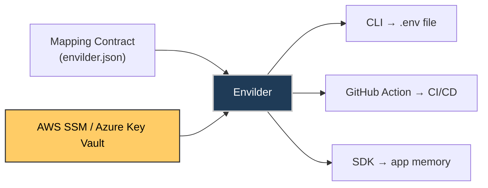

# 🗝️ Envilder ☁️

<p align="center">
  
</p>

<p align="center">
  <b>One secret mapping for local dev, CI/CD, and runtime.</b><br>
  <span>Define secrets once in <code>envilder.json</code>. Resolve them consistently from AWS SSM or Azure Key Vault.</span><br>
  <a href="https://envilder.com"><strong>Website & docs → envilder.com</strong></a>
</p>

[](https://www.npmjs.com/package/envilder)
[](https://npmcharts.com/compare/envilder)
[](https://github.com/macalbert/envilder/actions/workflows/tests.yml)
[](https://macalbert.github.io/envilder/)
[](./LICENSE)

## Why Envilder?

Your new developer joins the team. They need environment variables to run the app locally.
What happens next? Someone sends API keys over Slack. Someone else digs up a wiki page
with outdated credentials. Forty-five minutes later, their `.env` file is "probably correct".

**Envilder fixes this with one versioned mapping contract.**

You create a JSON mapping between variable names and cloud secret paths. Envilder resolves
them from AWS SSM or Azure Key Vault. The same mapping file works in local dev (CLI),
CI/CD (GitHub Action), and application startup (runtime SDKs).

```bash
npx envilder --map=envilder.json --envfile=.env
```

No SaaS middleman. No duplicated config. No `.env` drift. Secrets stay in your cloud.

## The problem

- **Onboarding takes hours, not seconds.** Every new developer needs someone to explain which
  secrets go where. Keys get shared over Slack, pasted from wikis, or copied from a colleague's
  machine. It's slow, error-prone, and insecure.
- **Every environment has its own workflow.** Local dev reads `.env` files. CI/CD uses vault
  integrations. Production has its own method. Same app, three different secret workflows.
- **No single mapping contract.** Your cloud provider may be the source of truth for secret
  values, but each environment still needs to know how application variables map to those
  secrets. Without a versioned contract, dev, staging, and production configurations drift apart.

## How Envilder solves it

- 📋 **One mapping contract for everything.** A single `envilder.json` defines what secrets your app
  needs and where they live. Git-versioned, PR-reviewable, and reused across environments.
- ⚡ **Works everywhere your code runs.** CLI for local dev, GitHub Action for CI/CD, runtime SDKs
  for application startup. Same file, same result.
- 🔄 **Rotate secrets without config drift.** Keep application-facing variable names stable while
  rotating real secret values in AWS SSM or Azure Key Vault. Local dev, CI/CD, and runtime keep
  using the same mapping contract.
- 🛡️ **Your cloud, zero infrastructure.** Secrets stay in AWS SSM or Azure Key Vault. No SaaS
  proxy, no extra servers, no data to migrate.

## ⚙️ Features

| Feature | Description |
|---------|-------------|
| 📋 **Declarative Mapping** | One JSON file defines how application variables map to cloud secrets. Git-versioned, PR-reviewable, and diff-able |
| ☁️ **Cloud-native Providers** | AWS SSM and Azure Key Vault today |
| 🔌 **Runtime SDKs** | Load secrets into memory at app startup: [.NET](./src/sdks/dotnet/README.md), [Python](./src/sdks/python/README.md), [Node.js](./src/sdks/nodejs/README.md). No `.env` on disk |
| ⚙️ **GitHub Action** | Pull secrets in CI/CD. Same mapping, zero manual config |
| 🔄 **Pull & Controlled Push** | Pull secrets to `.env`, or intentionally push local values to your cloud provider when bootstrapping or rotating |
| 🧱 **Zero Infrastructure** | No servers, no proxies, no SaaS. Uses cloud services you already have |

## 🚀 Quick Start

### 1. Run with npx

```bash
npx envilder --version
```

Or install globally:

```bash
npm install -g envilder
```

> **Requirements:** Node.js v22.12+. AWS CLI or Azure CLI configured.
> See [full requirements](docs/requirements-installation.md).

### 2. Create a mapping file (`envilder.json`)

```json
{
  "$schema": "https://envilder.com/schema/map-file.v1.json",
  "DB_PASSWORD": "/my-app/db/password",
  "API_KEY": "/my-app/api-key"
}
```

### 3. Generate your `.env` file

```bash
npx envilder --map=envilder.json --envfile=.env
```

That's it. Your secrets are pulled from AWS SSM and written to `.env`.
Add `.env` to `.gitignore`. The mapping file is versioned and reviewable in PRs.

> 💡 Using Azure Key Vault? Add a `$config` section to your mapping file.
> See [Mapping File Format](#️-mapping-file-format) below.

### 🎥 See it in action

Watch how easy it is to automate your `.env` management in less than 1 minute:


## 🗺️ Mapping File Format

The mapping file (`envilder.json`) is the core of Envilder. It's the single model that defines
what secrets your app needs and where they live in your cloud provider. The same file is used by
the CLI, the GitHub Action, and the runtime SDKs. You can optionally include a `$config` section
to declare which provider and settings to use.

Add `"$schema"` to enable IDE autocomplete, inline documentation, and validation for your map
files. The schema is published at
[envilder.com/schema/map-file.v1.json](https://envilder.com/schema/map-file.v1.json).

### Basic Format (AWS SSM, default)

When no `$config` is present, Envilder defaults to AWS SSM Parameter Store:

```json
{
  "$schema": "https://envilder.com/schema/map-file.v1.json",
  "API_KEY": "/myapp/prod/api-key",
  "DB_PASSWORD": "/myapp/prod/db-password",
  "SECRET_TOKEN": "/myapp/prod/secret-token"
}
```

Values are SSM parameter paths (e.g., `/myapp/prod/api-key`).

### With `$config` (explicit provider)

Add a `$config` key to declare the provider and its settings. Envilder reads `$config` for configuration
and uses all other keys as secret mappings:

**AWS SSM with profile:**

```json
{
  "$schema": "https://envilder.com/schema/map-file.v1.json",
  "$config": {
    "provider": "aws",
    "profile": "prod-account"
  },
  "API_KEY": "/myapp/prod/api-key",
  "DB_PASSWORD": "/myapp/prod/db-password"
}
```

**Azure Key Vault:**

```json
{
  "$schema": "https://envilder.com/schema/map-file.v1.json",
  "$config": {
    "provider": "azure",
    "vaultUrl": "https://my-vault.vault.azure.net"
  },
  "API_KEY": "myapp-prod-api-key",
  "DB_PASSWORD": "myapp-prod-db-password"
}
```

> **Azure naming:** Key Vault secret names only allow alphanumeric characters and hyphens.
> Envilder automatically normalizes names: slashes and underscores become hyphens
> (e.g., `/myapp/db/password` → `myapp-db-password`).

### `$config` Options

| Key | Type | Default | Description |
| --- | --- | --- | --- |
| `provider` | `"aws"` \| `"azure"` | `"aws"` | Cloud provider to use |
| `vaultUrl` | `string` | - | Azure Key Vault URL (required when `provider` is `"azure"`) |
| `profile` | `string` | - | AWS CLI profile for multi-account setups (AWS only) |

### Configuration Priority

CLI flags and GitHub Action inputs always override `$config` values:

```txt
CLI flags / GHA inputs  >  $config in map file  >  defaults (AWS)
```

This means you can set a default provider in `$config` and override it per invocation:

```bash
# Uses $config from the map file
envilder --map=envilder.json --envfile=.env

# Overrides provider and vault URL from the map file
envilder --provider=azure --vault-url=https://other-vault.vault.azure.net --map=envilder.json --envfile=.env
```

## 🧩 Runtime SDKs

Beyond the CLI and GitHub Action, Envilder provides **runtime SDKs** that resolve secrets
directly into your application's memory at startup. No `.env` file written to disk, no secrets
left behind. SDKs use the same map-file format as the CLI.

### .NET SDK

Install via NuGet:

```bash
dotnet add package Envilder
```

Load secrets into `IConfiguration` or inject them into the process environment:

```csharp
// Option A: integrate with IConfiguration
var config = new ConfigurationBuilder()
    .AddEnvilder("envilder.json")
    .Build();

var dbPassword = config["DB_PASSWORD"];

// Option B: resolve + inject into environment
Env.Load("envilder.json");
var dbPassword = Environment.GetEnvironmentVariable("DB_PASSWORD");
```

📖 **[Full .NET SDK docs](./src/sdks/dotnet/README.md)** · 💡 **[Examples](./examples/sdk/dotnet/)**

### Python SDK

Install via uv (recommended) or pip:

```bash
uv add envilder
# or
pip install envilder
```

Load secrets into your application with a single line:

```python
from envilder import Envilder

# Resolve + inject into os.environ
Envilder.load('envilder.json')
```

Or route by environment, where each environment points to its own map file:

```python
from envilder import Envilder

Envilder.load('production', {
    'production': 'prod-secrets.json',
    'development': 'dev-secrets.json',
    'test': None,  # no secrets loaded
})
```

📖 **[Full Python SDK docs](./src/sdks/python/README.md)** · 💡 **[Examples](./examples/sdk/python/)**

### Node.js SDK

Install via npm:

```bash
npm install @envilder/sdk
```

Load secrets into your application with a single line:

```typescript
import { Envilder } from '@envilder/sdk';

// Resolve + inject into process.env
const secrets = await Envilder.load('envilder.json');
```

Or use the fluent builder for full control:

```typescript
import { Envilder, SecretProviderType } from '@envilder/sdk';

const secrets = await Envilder.fromMapFile('envilder.json')
  .withProvider(SecretProviderType.Aws)
  .withProfile('prod-account')
  .resolve();
```

📖 **[Full Node.js SDK docs](./src/sdks/nodejs/README.md)** · 💡 **[Examples](./examples/sdk/nodejs/)**

## 🤖 GitHub Action

**AWS SSM (default):**

```yaml
- name: Configure AWS Credentials
  uses: aws-actions/configure-aws-credentials@v5
  with:
    role-to-assume: ${{ secrets.AWS_ROLE_TO_ASSUME }}
    aws-region: us-east-1

- name: Pull secrets from AWS SSM
  uses: macalbert/envilder/github-action@v0.11.0
  with:
    map-file: envilder.json
    env-file: .env
```

**Azure Key Vault:**

```yaml
- name: Azure Login
  uses: azure/login@v2
  with:
    client-id: ${{ secrets.AZURE_CLIENT_ID }}
    tenant-id: ${{ secrets.AZURE_TENANT_ID }}
    subscription-id: ${{ secrets.AZURE_SUBSCRIPTION_ID }}

- name: Pull secrets from Azure Key Vault
  uses: macalbert/envilder/github-action@v0.11.0
  with:
    map-file: envilder.json
    env-file: .env
    provider: azure
    vault-url: ${{ secrets.AZURE_KEY_VAULT_URL }}
```

📖 **[Full GitHub Action docs](./github-action/README.md)**

### 📚 More resources

- [📖 Full Documentation](https://envilder.com): the complete guide at envilder.com
- [Push Command Guide](docs/push-command.md)
- [Pull Command Guide](docs/pull-command.md)

## 🛠️ How it works


```mermaid
graph LR
    A["Mapping Contract<br/>(envilder.json)"] --> B[Envilder]:::core
    B --> C["CLI → .env file"]
    B --> D["GitHub Action → CI/CD"]
    B --> E["SDK → app memory"]
    F["AWS SSM / Azure Key Vault"]:::cloud --> B

    classDef cloud fill:#ffcc66,color:#000000,stroke:#333,stroke-width:1.5px;
    classDef core fill:#1f3b57,color:#fff,stroke:#ccc,stroke-width:2px;
```

1. **Define**: create an `envilder.json` mapping env var names to cloud secret paths
2. **Resolve**: Envilder fetches each secret from your cloud vault
3. **Deliver**: secrets arrive as a `.env` file (CLI/GHA) or in-memory (SDKs)
4. **Rotate**: update secret values in your cloud provider while keeping the same
   application-facing mapping
5. **Bootstrap**: optionally push local values to your cloud provider when intentionally
   setting up or rotating secrets

## What Envilder is not

Envilder is not a secrets manager. It does not replace Vault, Infisical, or Doppler.

It also does not replace AWS SSM or Azure Key Vault — it works on top of them. Envilder does not
store secrets, proxy requests, or introduce a SaaS control plane.

Your cloud provider remains the source of truth. Envilder provides the mapping and resolution
layer that makes those secrets usable consistently across local development, CI/CD, and runtime.

Use Envilder when your secrets already live in your cloud provider and you want one versioned
`envilder.json` mapping contract everywhere your code runs.

## 🏁 What's Next

Envilder already covers CLI, GitHub Action, and runtime SDKs for .NET, Python, and Node.js.

Next priorities include Go and Java SDKs, GCP Secret Manager, HashiCorp Vault, and exec mode.

See the [full roadmap](./ROADMAP.md).

## 🤝 Contributing

All contributions are welcome: PRs, issues, docs, examples, and feedback from real usage.

Good first contributions include trying Envilder with an existing AWS SSM or Azure Key Vault
setup, improving examples, testing the GitHub Action, or reviewing SDK ergonomics.

See [CONTRIBUTING.md](./CONTRIBUTING.md).

## 💜 Sponsors

<p align="center">
  <a href="https://localstack.cloud" target="_blank" rel="noopener noreferrer">
    <picture>
      <source media="(prefers-color-scheme: dark)" srcset="./src/website/public/localstack-logo-horizontal-Light.svg">
      <source media="(prefers-color-scheme: light)" srcset="./src/website/public/localstack-logo-horizontal-Dark.svg">
      
    </picture>
  </a>
</p>

<p align="center">
  Supported by <a href="https://localstack.cloud">LocalStack</a>.
</p>

<p align="center">
  Envilder is also supported through the
  <a href="https://aws.amazon.com/blogs/opensource/aws-cloud-credits-for-open-source-projects-affirming-our-commitment/">
    AWS Open Source Credits Program
  </a>.
</p>

## 📜 License

MIT © [Marçal Albert](https://github.com/macalbert)  
See [LICENSE](./LICENSE) | [CHANGELOG](./docs/CHANGELOG.md) | [Security Policy](./docs/SECURITY.md)
