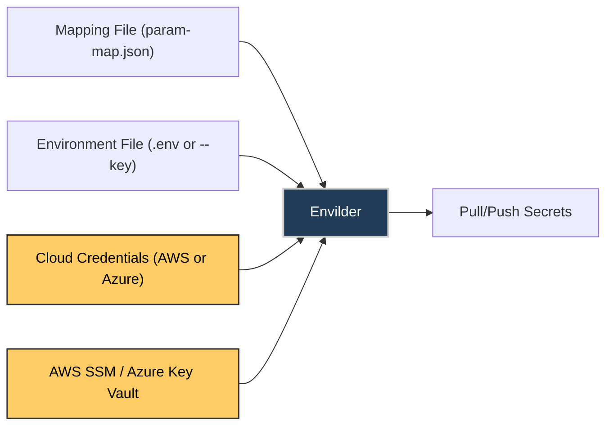

# 🗝️ Envilder ☁️

<p align="center">
  
</p>

<p align="center">
  <b>Automate .env and secret management with Envilder</b><br>
  <span>Streamline your environment setup with AWS SSM Parameter Store or Azure Key Vault</span>
</p>


[](https://www.npmjs.com/package/envilder)
[](https://npmcharts.com/compare/envilder)
[](https://github.com/macalbert/envilder/actions/workflows/tests.yml)
[](https://macalbert.github.io/envilder/)

[](https://macalbert.github.io/envilder/core/index.html)
[](https://macalbert.github.io/envilder/dotnet/index.html)
[](https://macalbert.github.io/envilder/python/index.html)
[](https://macalbert.github.io/envilder/iac/index.html)

[](https://snyk.io/test/github/macalbert/envilder)
[](./LICENSE)

## Why centralize environment variables?

Envilder is a CLI tool for .env automation, cloud secrets management, and secure environment variable sync.
Generating and maintaining consistent .env files is a real pain point for any development team. From outdated
secrets to insecure practices, the risks are tangible. Envilder eliminates these pitfalls by centralizing and
automating secret management across real-world environments (dev, test, production) in a simple, secure, and
efficient way. Use Envilder to automate .env files, sync secrets with AWS SSM Parameter Store or Azure Key Vault,
and streamline onboarding and CI/CD workflows.

---

## ❗ What Envilder solves

- Desync between environments (dev, prod)
- Secrets not properly propagated across team members
- CI/CD pipeline failures due to outdated or missing .env files
- Slow and manual onboarding processes
- Security risks from sharing secrets via Slack, email, or other channels
- Insecure .env practices and manual secret sharing

## ✅ How Envilder makes life easier

- 🛡️ Centralizes secrets in AWS SSM Parameter Store or Azure Key Vault
- ☁️ Multi-provider support — choose `aws` or `azure` with the `--provider` flag
- ⚙️ Generates .env files automatically for every environment
- 🔄 Applies changes idempotently and instantly
- 🔐 Improves security: no need to share secrets manually; everything is managed via your cloud provider
- 👥 Simplifies onboarding and internal rotations
- 🚀 Enables cloud-native, infrastructure-as-code secret management
- 🤖 Perfect for DevOps, CI/CD, and team sync
- 📦 **Runtime SDKs** — load secrets directly into your app without `.env` files ([.NET SDK](./src/sdks/dotnet/README.md),
 [Python SDK](./src/sdks/python/README.md))

---

## 📚 Table of Contents

- [🗝️ Envilder ☁️](#️-envilder-️)
  - [Why centralize environment variables?](#why-centralize-environment-variables)
  - [❗ What Envilder solves](#-what-envilder-solves)
  - [✅ How Envilder makes life easier](#-how-envilder-makes-life-easier)
  - [📚 Table of Contents](#-table-of-contents)
  - [⚙️ Features](#️-features)
    - [🧱 Feature Status](#-feature-status)
  - [💾 Installation](#-installation)
    - [🤖 GitHub Action](#-github-action)
  - [🚀 Quick Start](#-quick-start)
    - [🎥 Video Demonstration](#-video-demonstration)
    - [🏁 Get Started (3 steps)](#-get-started-3-steps)
      - [AWS SSM (default)](#aws-ssm-default)
      - [Azure Key Vault](#azure-key-vault)
    - [📚 Quick Links](#-quick-links)
  - [🗺️ Mapping File Format](#️-mapping-file-format)
    - [Basic Format (AWS SSM — default)](#basic-format-aws-ssm--default)
    - [With `$config` (explicit provider)](#with-config-explicit-provider)
    - [`$config` Options](#config-options)
    - [Configuration Priority](#configuration-priority)
  - [🧩 Runtime SDKs](#-runtime-sdks)
    - [.NET SDK](#net-sdk)
    - [Python SDK](#python-sdk)
  - [🛠️ How it works](#️-how-it-works)
  - [Frequently Asked Questions (FAQ)](#frequently-asked-questions-faq)
  - [🔍 Envilder vs. Alternatives](#-envilder-vs-alternatives)
    - [Secrets sync tools (direct alternatives)](#secrets-sync-tools-direct-alternatives)
    - [Runtime \& credential tools (not direct alternatives)](#runtime--credential-tools-not-direct-alternatives)
    - [When to use what](#when-to-use-what)
    - [Why choose Envilder?](#why-choose-envilder)
    - [Where Envilder fits best](#where-envilder-fits-best)
  - [🏁 Roadmap](#-roadmap)
  - [🤝 Contributing](#-contributing)
  - [💜 Sponsors](#-sponsors)
  - [📜 License](#-license)

---

## ⚙️ Features

- 🔒 **Strict access control** — IAM policies (AWS) or RBAC (Azure) define access to secrets across stages
(dev, staging, prod)
- 📊 **Auditable** — All reads/writes are logged in AWS CloudTrail or Azure Monitor
- 🧩 **Single source of truth** — No more Notion, emails or copy/paste of envs
- 🔁 **Idempotent sync** — Only what's in your map gets updated. Nothing else is touched
- 🧱 **Zero infrastructure** — Fully based on native cloud services. No Lambdas, no servers, no fuss

### 🧱 Feature Status

- 🤖 **GitHub Action** — [Integrate directly in CI/CD workflows](./github-action/README.md)
- 📤 **Push & Pull** — Bidirectional sync between local `.env` and your cloud provider
- ☁️ **Multi-provider** — AWS SSM Parameter Store and Azure Key Vault
- 🎯 **AWS Profile support** — Use `--profile` flag for multi-account setups
- 🧩 **.NET SDK** — [Load secrets at runtime via `IConfiguration`](./src/sdks/dotnet/README.md)
- 🐍 **Python SDK** — [Load secrets at runtime via `EnvilderClient`](./src/sdks/python/README.md)

---

## 💾 Installation

🛠 Requirements:

- Node.js **v20+** (cloud-native compatible)
- **AWS provider**: AWS CLI installed and configured; IAM user/role with `ssm:GetParameter`, `ssm:PutParameter`
- **Azure provider**: Azure CLI installed; vault URL configured via
`$config.vaultUrl` in your map file or `--vault-url` flag

```bash
pnpm add -g envilder
```

Or use your preferred package manager:

```bash
npm install -g envilder
```

> 💡 **Want to try without installing?** Run `npx envilder --help` to explore the CLI instantly.
>
> 💡 **New to AWS SSM?** AWS Systems Manager Parameter Store provides secure storage for configuration data and secrets:
>
> - [AWS SSM Parameter Store Overview](https://docs.aws.amazon.com/systems-manager/latest/userguide/systems-manager-parameter-store.html)
> - [Setting up AWS CLI credentials](https://docs.aws.amazon.com/cli/latest/userguide/cli-configure-files.html)
> - [IAM permissions for SSM](https://docs.aws.amazon.com/systems-manager/latest/userguide/setup-instance-profile.html)
>
> 💡 **New to Azure Key Vault?** Azure Key Vault safeguards cryptographic keys and secrets used by cloud apps:
>
> - [Azure Key Vault Overview](https://learn.microsoft.com/en-us/azure/key-vault/general/overview)
> - [Setting up Azure CLI](https://learn.microsoft.com/en-us/cli/azure/install-azure-cli)
> - [Key Vault access policies](https://learn.microsoft.com/en-us/azure/key-vault/general/assign-access-policy)

### 🤖 GitHub Action

Use Envilder directly in your CI/CD workflows with our official GitHub Action:

**AWS SSM (default):**

```yaml
- name: Configure AWS Credentials
  uses: aws-actions/configure-aws-credentials@v5
  with:
    role-to-assume: ${{ secrets.AWS_ROLE_TO_ASSUME }}
    aws-region: us-east-1

- name: Pull secrets from AWS SSM
  uses: macalbert/envilder/github-action@v0.8.0
  with:
    map-file: param-map.json
    env-file: .env
```

**Azure Key Vault:**

```yaml
- name: Azure Login
  uses: azure/login@v2
  with:
    client-id: ${{ secrets.AZURE_CLIENT_ID }}
    tenant-id: ${{ secrets.AZURE_TENANT_ID }}
    subscription-id: ${{ secrets.AZURE_SUBSCRIPTION_ID }}

- name: Pull secrets from Azure Key Vault
  uses: macalbert/envilder/github-action@v0.8.0
  with:
    map-file: param-map.json
    env-file: .env
    provider: azure
    vault-url: ${{ secrets.AZURE_KEY_VAULT_URL }}
```

📖 **[View full GitHub Action documentation](./github-action/README.md)**

---

## 🚀 Quick Start

### 🎥 Video Demonstration

Watch how easy it is to automate your .env management in less than 1 minute:  


### 🏁 Get Started (3 steps)

After configuring your cloud provider credentials, you can begin managing your secrets.

#### AWS SSM (default)

1. **Create a mapping file:**

   ```json
   {
     "DB_PASSWORD": "/my-app/db/password"
   }
   ```

2. **Push a secret to AWS SSM:**

   ```bash
   envilder --push --key=DB_PASSWORD --value=12345 --secret-path=/my-app/db/password
   ```

3. **Generate your .env file from AWS SSM:**

   ```bash
   envilder --map=param-map.json --envfile=.env
   ```

#### Azure Key Vault

1. **Add `$config` to your mapping file:**

   ```json
   {
     "$config": {
       "provider": "azure",
       "vaultUrl": "https://my-vault.vault.azure.net"
     },
     "DB_PASSWORD": "my-app-db-password"
   }
   ```

2. **Pull secrets from Azure Key Vault:**

   ```bash
   envilder --map=param-map.json --envfile=.env
   ```

   Or use CLI flags to override:

   ```bash
   envilder --provider=azure --vault-url=https://my-vault.vault.azure.net --map=param-map.json --envfile=.env
   ```

Your secrets are now managed and versioned from your cloud provider. Add `.env` to your `.gitignore` for security.
Envilder is designed for automation, onboarding, and secure cloud-native workflows.

### 📚 Quick Links

- [📖 Full Documentation](https://envilder.com) — Visit envilder.com for the complete guide
- [Requirements & Installation](docs/requirements-installation.md)
- [Push Command Guide](docs/push-command.md)
- [Pull Command Guide](docs/pull-command.md)

---

## 🗺️ Mapping File Format

The mapping file (`param-map.json`) is the core of Envilder. It maps environment variable names to secret paths
in your cloud provider. You can optionally include a `$config` section to declare which provider and settings to use.

### Basic Format (AWS SSM — default)

When no `$config` is present, Envilder defaults to AWS SSM Parameter Store:

```json
{
  "API_KEY": "/myapp/prod/api-key",
  "DB_PASSWORD": "/myapp/prod/db-password",
  "SECRET_TOKEN": "/myapp/prod/secret-token"
}
```

Values are SSM parameter paths (e.g., `/myapp/prod/api-key`).

### With `$config` (explicit provider)

Add a `$config` key to declare the provider and its settings. Envilder reads `$config` for configuration
and uses all other keys as secret mappings:

**AWS SSM with profile:**

```json
{
  "$config": {
    "provider": "aws",
    "profile": "prod-account"
  },
  "API_KEY": "/myapp/prod/api-key",
  "DB_PASSWORD": "/myapp/prod/db-password"
}
```

**Azure Key Vault:**

```json
{
  "$config": {
    "provider": "azure",
    "vaultUrl": "https://my-vault.vault.azure.net"
  },
  "API_KEY": "myapp-prod-api-key",
  "DB_PASSWORD": "myapp-prod-db-password"
}
```

> **Azure naming:** Key Vault secret names only allow alphanumeric characters and hyphens.
> Envilder automatically normalizes names — slashes and underscores become hyphens
> (e.g., `/myapp/db/password` → `myapp-db-password`).

### `$config` Options

| Key | Type | Default | Description |
| --- | --- | --- | --- |
| `provider` | `"aws"` \| `"azure"` | `"aws"` | Cloud provider to use |
| `vaultUrl` | `string` | — | Azure Key Vault URL (required when `provider` is `"azure"`) |
| `profile` | `string` | — | AWS CLI profile for multi-account setups (AWS only) |

### Configuration Priority

CLI flags and GitHub Action inputs always override `$config` values:

```txt
CLI flags / GHA inputs  >  $config in map file  >  defaults (AWS)
```

This means you can set a default provider in `$config` and override it per invocation:

```bash
# Uses $config from the map file
envilder --map=param-map.json --envfile=.env

# Overrides provider and vault URL from the map file
envilder --provider=azure --vault-url=https://other-vault.vault.azure.net --map=param-map.json --envfile=.env
```

---

## 🧩 Runtime SDKs

Beyond the CLI and GitHub Action, Envilder provides **runtime SDKs** that load secrets
directly into your application — no `.env` file needed. SDKs use the same map-file format
as the CLI.

### .NET SDK

Install via NuGet:

```bash
dotnet add package Envilder
```

Load secrets into `IConfiguration`:

```csharp
var mapFile = new MapFileParser().Parse(File.ReadAllText("secrets-map.json"));
var provider = SecretProviderFactory.Create(mapFile.Config);

var config = new ConfigurationBuilder()
    .AddEnvilder("secrets-map.json", provider)
    .Build();

var dbPassword = config["DB_PASSWORD"];
```

Or inject directly into process environment variables:

```csharp
var client = new EnvilderClient(provider);
var secrets = await client.ResolveSecretsAsync(mapFile);
EnvilderClient.InjectIntoEnvironment(secrets);
```

📖 **[View full .NET SDK documentation](./src/sdks/dotnet/README.md)**

### Python SDK

Install via uv:

```bash
uv add envilder
```

Load secrets into your application with a single line:

```python
from envilder import Envilder

# Resolve + inject into os.environ
Envilder.load('secrets-map.json')
```

Or route by environment — each environment points to its own map file:

```python
from envilder import Envilder

Envilder.load('production', {
    'production': 'prod-secrets.json',
    'development': 'dev-secrets.json',
    'test': None,  # no secrets loaded
})
```

📖 **[View full Python SDK documentation](./src/sdks/python/README.md)**

---

## 🛠️ How it works


```mermaid
graph LR
    A["Mapping File (param-map.json)"] --> B[Envilder]:::core
    C["Environment File (.env or --key)"] --> B
    D["Cloud Credentials (AWS or Azure)"]:::cloud --> B
    E["AWS SSM / Azure Key Vault"]:::cloud --> B
    B --> F["Pull/Push Secrets"]

    classDef cloud fill:#ffcc66,color:#000000,stroke:#333,stroke-width:1.5px;
    classDef core fill:#1f3b57,color:#fff,stroke:#ccc,stroke-width:2px;
```

1. Define mappings in a JSON file: `{"DB_PASSWORD": "/myapp/db/password"}`
2. **Pull** secrets into a `.env` file: `envilder --map=param-map.json --envfile=.env`
3. **Push** local values back: `envilder --push --map=param-map.json --envfile=.env`
4. Envilder syncs secrets securely with AWS SSM or Azure Key Vault using your cloud credentials
5. Use `--provider=azure` to switch from the default AWS provider
6. Result: your secrets are always up-to-date, secure, and ready for any environment

---

## Frequently Asked Questions (FAQ)

**Q: What is Envilder?**  
A: Envilder is a CLI tool for automating .env and secret management using AWS SSM Parameter Store or Azure Key Vault.

**Q: Which cloud providers are supported?**  
A: AWS SSM Parameter Store (default) and Azure Key Vault. Use `--provider=azure` to switch providers.

**Q: How does Envilder improve security?**  
A: Secrets are never stored in code or shared via chat/email. All secrets are managed and synced securely via your
cloud provider.

**Q: Can I use Envilder in CI/CD pipelines?**  
A: Yes! Use the official [Envilder GitHub Action](./github-action/README.md) to pull secrets directly
in your workflows — no extra setup needed.

**Q: Does Envilder support multiple AWS profiles?**  
A: Yes, you can use the `--profile` flag to select different AWS credentials.

**Q: How do I configure Azure Key Vault?**  
A: Add a `$config` section to your map file with `"provider": "azure"` and `"vaultUrl": "https://my-vault.vault.azure.net"`,
or use `--provider=azure --vault-url=https://my-vault.vault.azure.net` CLI flags. Authentication uses Azure
Default Credentials (Azure CLI, managed identity, etc.).

**Q: What environments does Envilder support?**  
A: Any environment supported by your cloud provider—dev, test, staging, production, etc.

**Q: Is Envilder open source?**  
A: Yes, licensed under MIT.

**Q: Can I use Envilder without generating `.env` files?**  
A: Yes! The runtime SDKs ([.NET](./src/sdks/dotnet/README.md), [Python](./src/sdks/python/README.md))
load secrets directly into your application at startup — no `.env` file needed. Use the CLI for local dev
and CI/CD, and the SDK for production runtime.

---

## 🔍 Envilder vs. Alternatives

Envilder is not a secrets manager. It is a **deterministic projection layer** from cloud secret
stores into `.env` files. It does not store secrets, does not require a backend, and integrates
cleanly into CI/CD pipelines.

To make a fair comparison, it's important to separate tools by what they actually do:

### Secrets sync tools (direct alternatives)

These tools manage secrets as data and project them into `.env` or runtime:

| Feature | Envilder | dotenv-vault | infisical |
|---------|----------|-------------|----------|
| **Source of truth** | External (SSM / Key Vault) | dotenv vault (SaaS) | Infisical backend |
| **Sync direction** | Bidirectional | Pull only | Bidirectional |
| **Declarative mapping** | ✅ JSON mapping | ❌ | ❌ |
| **Multi-provider (AWS + Azure)** | ✅ | ❌ | ⚠️ (primarily its own backend) |
| **Local `.env` generation** | ✅ | ✅ | ✅ |
| **Runtime SDKs** | ✅ (.NET, Python) | ❌ | ❌ |
| **CI/CD integration** | ✅ Native GitHub Action | Manual | ✅ Native |
| **Requires SaaS** | ❌ | ✅ | Optional |
| **Self-hosted** | N/A (no server needed) | ❌ | ✅ |
| **Complexity** | Low | Low | Medium |
| **Vendor lock-in** | Low | High | Medium |
| **Open source** | ✅ MIT | Partial | ✅ |

### Runtime & credential tools (not direct alternatives)

These tools serve different purposes and are better seen as **complements**, not competitors:

| Tool | Purpose | Manages app secrets? | Works with `.env`? |
|------|---------|---------------------|-------------------|
| **chamber** | Injects SSM params at runtime (`exec` with env) | ❌ | ❌ |
| **aws-vault** | Safely assumes AWS IAM roles / STS credentials | ❌ | ❌ |

### When to use what

- **Need a full vault with its own backend?** → [Infisical](https://infisical.com)
- **Need SaaS simplicity for `.env` sync?** → [dotenv-vault](https://www.dotenv.org/vault)
- **Need a projection layer from existing cloud stores?** → **Envilder**

### Why choose Envilder?

If you already use AWS SSM or Azure Key Vault and want a lightweight, zero-infrastructure CLI
that generates `.env` files from a declarative JSON mapping — without a SaaS dependency or extra
servers — Envilder is the simplest path.

Envilder also brings unique strengths in **determinism** and **testability**:

- **Versioned mappings** — your `param-map.json` lives in source control, making secret
  projections reproducible across environments
- **Mockable architecture** — hexagonal design with port interfaces makes offline testing
  and CI validation straightforward
- **Audit trail** — all reads/writes are logged by your cloud provider
  (AWS CloudTrail / Azure Monitor), not by a third-party SaaS

### Where Envilder fits best

Envilder generates `.env` files on disk. This is ideal for:

- **Local development** — onboard new team members with a single command
- **CI/CD pipelines** — inject secrets at build time without hardcoding them
- **SSG/SSR builds** — frameworks like Next.js, Nuxt, or Astro that read env vars at build time

For **production runtime**, container orchestrators (ECS, Kubernetes) and platform services
(Vercel, Fly.io) can inject secrets directly as environment variables — no `.env` file needed.
In those cases, prefer native secret injection over writing secrets to disk.

> **Runtime SDKs:** The [.NET SDK](./src/sdks/dotnet/README.md) and [Python SDK](./src/sdks/python/README.md)
> can load secrets directly into your application at startup. More SDKs (TypeScript, Go, Java) are coming next.
> See the [Roadmap](./ROADMAP.md).

---

## 🏁 Roadmap

We're continuously improving Envilder based on community feedback. Upcoming features include:

- ✅ **Azure Key Vault support** — now available alongside AWS SSM
- ✅ **.NET SDK** — load secrets at runtime via `IConfiguration` or `EnvilderClient`
- ✅ **Python SDK** — load secrets at runtime via `EnvilderClient`
- 🔜 **More runtime SDKs** — TypeScript, Go, Java
- 🔜 **Exec mode** — inject secrets into a child process without writing to disk
- 🔍 **Check/sync mode** for drift detection
- 🧠 **Auto-discovery** for bulk parameter fetching
- 🔌 **More backends** (GCP Secret Manager, AWS Secrets Manager, etc.)

👉 **[View full roadmap with priorities](./ROADMAP.md)**

---

## 🤝 Contributing

All help is welcome — PRs, issues, ideas!

- 🔧 Use our [Pull Request Template](.github/pull_request_template.md)
- 🧪 Add tests where possible
- 💬 Feedback and discussion welcome
- 🏗️ Check our [Architecture Documentation](./docs/architecture/README.md)
- 🔒 Review our [Security Policy](./docs/SECURITY.md)

---

## 💜 Sponsors

<p align="center">
  <a href="https://localstack.cloud" target="_blank" rel="noopener noreferrer">
    <picture>
      <source media="(prefers-color-scheme: dark)" srcset="./src/website/public/localstack-logo-horizontal-Light.svg">
      <source media="(prefers-color-scheme: light)" srcset="./src/website/public/localstack-logo-horizontal-Dark.svg">
      
    </picture>
  </a>
</p>

<p align="center">
  Proudly supported by <a href="https://localstack.cloud">LocalStack</a> — powering Envilder's integration tests.
</p>

---

## 📜 License

MIT © [Marçal Albert](https://github.com/macalbert)  
See [LICENSE](./LICENSE) | [CHANGELOG](./docs/CHANGELOG.md) | [Security Policy](./docs/SECURITY.md)
