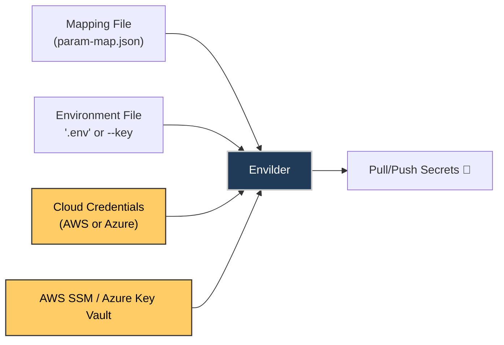

# 🗝️ Envilder ☁️

<p align="center">
  
</p>

<p align="center">
  <b>Automate .env and secret management with Envilder</b><br>
  <span>Streamline your environment setup with AWS SSM Parameter Store or Azure Key Vault</span>
</p>


[](https://www.npmjs.com/package/envilder)
[](https://npmcharts.com/compare/envilder)
[](https://github.com/macalbert/envilder/actions/workflows/tests.yml)
[](https://macalbert.github.io/envilder/)
[](https://snyk.io/test/github/macalbert/envilder)
[](./LICENSE)

## Why centralize environment variables?

Envilder is a CLI tool for .env automation, cloud secrets management, and secure environment variable sync.
Generating and maintaining consistent .env files is a real pain point for any development team. From outdated
secrets to insecure practices, the risks are tangible. Envilder eliminates these pitfalls by centralizing and
automating secret management across real-world environments (dev, test, production) in a simple, secure, and
efficient way. Use Envilder to automate .env files, sync secrets with AWS SSM Parameter Store or Azure Key Vault,
and streamline onboarding and CI/CD workflows.

---

## ❗ What Envilder solves

- Desync between environments (dev, prod)
- Secrets not properly propagated across team members
- CI/CD pipeline failures due to outdated or missing .env files
- Slow and manual onboarding processes
- Security risks from sharing secrets via Slack, email, or other channels
- Insecure .env practices and manual secret sharing

## ✅ How Envilder makes life easier

- 🛡️ Centralizes secrets in AWS SSM Parameter Store or Azure Key Vault
- ☁️ Multi-provider support — choose `aws` or `azure` with the `--provider` flag
- ⚙️ Generates .env files automatically for every environment
- 🔄 Applies changes idempotently and instantly
- 🔐 Improves security: no need to share secrets manually; everything is managed via your cloud provider
- 👥 Simplifies onboarding and internal rotations
- 🚀 Enables cloud-native, infrastructure-as-code secret management
- 🤖 Perfect for DevOps, CI/CD, and team sync

---

## 📚 Table of Contents

- [🗝️ Envilder ☁️](#️-envilder-️)
  - [Why centralize environment variables?](#why-centralize-environment-variables)
  - [❗ What Envilder solves](#-what-envilder-solves)
  - [✅ How Envilder makes life easier](#-how-envilder-makes-life-easier)
  - [📚 Table of Contents](#-table-of-contents)
  - [⚙️ Features](#️-features)
    - [🧱 Feature Status](#-feature-status)
  - [💾 Installation](#-installation)
    - [🤖 GitHub Action](#-github-action)
  - [🚀 Quick Start](#-quick-start)
    - [🎥 Video Demonstration](#-video-demonstration)
    - [🏁 Get Started (3 steps)](#-get-started-3-steps)
      - [AWS SSM (default)](#aws-ssm-default)
      - [Azure Key Vault](#azure-key-vault)
    - [📚 Quick Links](#-quick-links)
  - [🛠️ How it works](#️-how-it-works)
  - [Frequently Asked Questions (FAQ)](#frequently-asked-questions-faq)
  - [🏁 Roadmap](#-roadmap)
  - [🤝 Contributing](#-contributing)
  - [📜 License](#-license)

---

## ⚙️ Features

- 🔒 **Strict access control** — IAM policies (AWS) or RBAC (Azure) define access to secrets across stages
(dev, staging, prod)
- 📊 **Auditable** — All reads/writes are logged in AWS CloudTrail or Azure Monitor
- 🧩 **Single source of truth** — No more Notion, emails or copy/paste of envs
- 🔁 **Idempotent sync** — Only what's in your map gets updated. Nothing else is touched
- 🧱 **Zero infrastructure** — Fully based on native cloud services. No Lambdas, no servers, no fuss

### 🧱 Feature Status

- 🤖 **GitHub Action** — [Integrate directly in CI/CD workflows](./github-action/README.md)
- 📤 **Push & Pull** — Bidirectional sync between local `.env` and your cloud provider
- ☁️ **Multi-provider** — AWS SSM Parameter Store and Azure Key Vault
- 🎯 **AWS Profile support** — Use `--profile` flag for multi-account setups

---

## 💾 Installation

🛠 Requirements:

- Node.js **v20+** (cloud-native compatible)
- **AWS provider**: AWS CLI installed and configured; IAM user/role with `ssm:GetParameter`, `ssm:PutParameter`
- **Azure provider**: Azure CLI installed; vault URL configured via
`$config.vaultUrl` in your map file or `--vault-url` flag

```bash
pnpm add -g envilder
```

> 💡 **New to AWS SSM?** AWS Systems Manager Parameter Store provides secure storage for configuration data and secrets:
>
> - [AWS SSM Parameter Store Overview](https://docs.aws.amazon.com/systems-manager/latest/userguide/systems-manager-parameter-store.html)
> - [Setting up AWS CLI credentials](https://docs.aws.amazon.com/cli/latest/userguide/cli-configure-files.html)
> - [IAM permissions for SSM](https://docs.aws.amazon.com/systems-manager/latest/userguide/setup-instance-profile.html)
>
> 💡 **New to Azure Key Vault?** Azure Key Vault safeguards cryptographic keys and secrets used by cloud apps:
>
> - [Azure Key Vault Overview](https://learn.microsoft.com/en-us/azure/key-vault/general/overview)
> - [Setting up Azure CLI](https://learn.microsoft.com/en-us/cli/azure/install-azure-cli)
> - [Key Vault access policies](https://learn.microsoft.com/en-us/azure/key-vault/general/assign-access-policy)

### 🤖 GitHub Action

Use Envilder directly in your CI/CD workflows with our official GitHub Action:

**AWS SSM (default):**

```yaml
- name: Configure AWS Credentials
  uses: aws-actions/configure-aws-credentials@v5
  with:
    role-to-assume: ${{ secrets.AWS_ROLE_TO_ASSUME }}
    aws-region: us-east-1

- name: Pull secrets from AWS SSM
  uses: macalbert/envilder/github-action@v0.8.0
  with:
    map-file: param-map.json
    env-file: .env
```

**Azure Key Vault:**

```yaml
- name: Azure Login
  uses: azure/login@v2
  with:
    client-id: ${{ secrets.AZURE_CLIENT_ID }}
    tenant-id: ${{ secrets.AZURE_TENANT_ID }}
    subscription-id: ${{ secrets.AZURE_SUBSCRIPTION_ID }}

- name: Pull secrets from Azure Key Vault
  uses: macalbert/envilder/github-action@v0.8.0
  with:
    map-file: param-map.json
    env-file: .env
    provider: azure
    vault-url: ${{ secrets.AZURE_KEY_VAULT_URL }}
```

📖 **[View full GitHub Action documentation](./github-action/README.md)**

---

## 🚀 Quick Start

### 🎥 Video Demonstration

Watch how easy it is to automate your .env management in less than 1 minute:  


### 🏁 Get Started (3 steps)

After configuring your cloud provider credentials, you can begin managing your secrets.

#### AWS SSM (default)

1. **Create a mapping file:**

   ```json
   {
     "DB_PASSWORD": "/my-app/db/password"
   }
   ```

2. **Push a secret to AWS SSM:**

   ```bash
   envilder --push --key=DB_PASSWORD --value=12345 --ssm-path=/my-app/db/password
   ```

3. **Generate your .env file from AWS SSM:**

   ```bash
   envilder --map=param-map.json --envfile=.env
   ```

#### Azure Key Vault

1. **Add `$config` to your mapping file:**

   ```json
   {
     "$config": {
       "provider": "azure",
       "vaultUrl": "https://my-vault.vault.azure.net"
     },
     "DB_PASSWORD": "my-app-db-password"
   }
   ```

2. **Pull secrets from Azure Key Vault:**

   ```bash
   envilder --map=param-map.json --envfile=.env
   ```

   Or use CLI flags to override:

   ```bash
   envilder --provider=azure --vault-url=https://my-vault.vault.azure.net --map=param-map.json --envfile=.env
   ```

Your secrets are now managed and versioned from your cloud provider. Add `.env` to your `.gitignore` for security.
Envilder is designed for automation, onboarding, and secure cloud-native workflows.

### 📚 Quick Links

- [Requirements & Installation](docs/requirements-installation.md)
- [Push Command Guide](docs/push-command.md)
- [Pull Command Guide](docs/pull-command.md)

---

## 🛠️ How it works


```mermaid
graph LR
    A["Mapping File<br/>(param-map.json)"] --> B[Envilder]:::core
    C["Environment File<br/> '.env' or --key"] --> B
    D["Cloud Credentials<br/>(AWS or Azure)"]:::cloud --> B
    E["AWS SSM / Azure Key Vault"]:::cloud --> B
    B --> F["Pull/Push Secrets 💾"]

    classDef cloud fill:#ffcc66,color:#000000,stroke:#333,stroke-width:1.5px;
    classDef core fill:#1f3b57,color:#fff,stroke:#ccc,stroke-width:2px;
```

1. Create a new `.env` file like `'ENV_VAR=12345'`
2. Define mappings in a JSON file : `{"ENV_VAR": "secret/path"}`
3. Run Envilder: `--push` to upload, or `--map` + `--envfile` to generate
4. Envilder syncs secrets securely with AWS SSM or Azure Key Vault using your cloud credentials
5. Use `--provider=azure` to switch from the default AWS provider
6. Result: your secrets are always up-to-date, secure, and ready for any environment

---

## Frequently Asked Questions (FAQ)

**Q: What is Envilder?**  
A: Envilder is a CLI tool for automating .env and secret management using AWS SSM Parameter Store or Azure Key Vault.

**Q: Which cloud providers are supported?**  
A: AWS SSM Parameter Store (default) and Azure Key Vault. Use `--provider=azure` to switch providers.

**Q: How does Envilder improve security?**  
A: Secrets are never stored in code or shared via chat/email. All secrets are managed and synced securely via your
cloud provider.

**Q: Can I use Envilder in CI/CD pipelines?**  
A: Yes! Envilder is designed for automation and works seamlessly in CI/CD workflows.

**Q: Does Envilder support multiple AWS profiles?**  
A: Yes, you can use the `--profile` flag to select different AWS credentials.

**Q: How do I configure Azure Key Vault?**  
A: Add a `$config` section to your map file with `"provider": "azure"` and `"vaultUrl": "https://my-vault.vault.azure.net"`,
or use `--provider=azure --vault-url=https://my-vault.vault.azure.net` CLI flags. Authentication uses Azure
Default Credentials (Azure CLI, managed identity, etc.).

**Q: What environments does Envilder support?**  
A: Any environment supported by your cloud provider—dev, test, staging, production, etc.

**Q: Is Envilder open source?**  
A: Yes, licensed under MIT.

---

## 🏁 Roadmap

We're continuously improving Envilder based on community feedback. Upcoming features include:

- ✅ **Azure Key Vault support** — now available alongside AWS SSM
- 🔍 **Check/sync mode** for drift detection
- 🧠 **Auto-discovery** for bulk parameter fetching
- 🔌 **More backends** (HashiCorp Vault, GCP Secret Manager, etc.)

👉 **[View full roadmap with priorities](./ROADMAP.md)**

---

## 🤝 Contributing

All help is welcome — PRs, issues, ideas!

- 🔧 Use our [Pull Request Template](.github/pull_request_template.md)
- 🧪 Add tests where possible
- 💬 Feedback and discussion welcome
- 🏗️ Check our [Architecture Documentation](./docs/architecture/README.md)
- 🔒 Review our [Security Policy](./docs/SECURITY.md)

---

## 📜 License

MIT © [Marçal Albert](https://github.com/macalbert)  
See [LICENSE](./LICENSE) | [CHANGELOG](./docs/CHANGELOG.md) | [Security Policy](./docs/SECURITY.md)
