# 🗝️ Envilder ☁️

<p align="center">
  
</p>

<p align="center">
  <b>Automate .env and secret management with Envilder</b><br>
  <span>Streamline your environment setup with AWS Parameter Store</span>
</p>

<p align="center">
  <a href="https://www.npmjs.com/package/envilder">
    
  </a>
  <a href="https://img.shields.io/npm/dm/envilder.svg">
    
  </a>
  <a href="https://github.com/macalbert/envilder/actions/workflows/tests.yml">
    
  </a>
  <a href="https://macalbert.github.io/envilder/">
    
  </a>
  <a href="https://snyk.io/test/github/macalbert/envilder">
    
  </a>
  <a href="./LICENSE">
    
  </a>
</p>

## Why centralize environment variables?

Envilder is a CLI tool for .env automation, AWS SSM secrets management, and secure environment variable sync.
Generating and maintaining consistent .env files is a real pain point for any development team. From outdated
secrets to insecure practices, the risks are tangible. Envilder eliminates these pitfalls by centralizing and
automating secret management across real-world environments (dev, test, production) in a simple, secure, and
efficient way. Use Envilder to automate .env files, sync secrets with AWS Parameter Store, and streamline
onboarding and CI/CD workflows.

---

## ❗ What Envilder solves

- Desync between environments (dev, prod)
- Secrets not properly propagated across team members
- CI/CD pipeline failures due to outdated or missing .env files
- Slow and manual onboarding processes
- Security risks from sharing secrets via Slack, email, or other channels
- Insecure .env practices and manual secret sharing

## ✅ How Envilder makes life easier

- 🛡️ Centralizes secrets in AWS Parameter Store
- ⚙️ Generates .env files automatically for every environment
- 🔄 Applies changes idempotently and instantly
- 🔐 Improves security: no need to share secrets manually; everything is managed via AWS SSM
- 👥 Simplifies onboarding and internal rotations
- 🚀 Enables cloud-native, infrastructure-as-code secret management
- 🤖 Perfect for DevOps, CI/CD, and team sync

---

## 📚 Table of Contents

- [🗝️ Envilder ☁️](#️-envilder-️)
  - [Why centralize environment variables?](#why-centralize-environment-variables)
  - [❗ What Envilder solves](#-what-envilder-solves)
  - [✅ How Envilder makes life easier](#-how-envilder-makes-life-easier)
  - [📚 Table of Contents](#-table-of-contents)
  - [⚙️ Features](#️-features)
    - [🧱 Feature Status](#-feature-status)
  - [💾 Installation](#-installation)
  - [🚀 Quick Start](#-quick-start)
    - [🎥 Video Demonstration](#-video-demonstration)
    - [🏁 Get Started (3 steps)](#-get-started-3-steps)
    - [📚 Quick Links](#-quick-links)
  - [🛠️ How it works](#️-how-it-works)
  - [Frequently Asked Questions (FAQ)](#frequently-asked-questions-faq)
  - [🏁 Roadmap](#-roadmap)
  - [🤝 Contributing](#-contributing)
  - [📜 License](#-license)

---

## ⚙️ Features

- 🔒 **Strict access control** — IAM policies define access to secrets across stages (dev, staging, prod)
- 📊 **Auditable** — All reads/writes are logged in AWS CloudTrail
- 🧩 **Single source of truth** — No more Notion, emails or copy/paste of envs
- 🔁 **Idempotent sync** — Only what’s in your map gets updated. Nothing else is touched
- 🧱 **Zero infrastructure** — Fully based on native AWS SSM. No Lambdas, no servers, no fuss

### 🧱 Feature Status

| Feature | Status | Notes |
|--|--|--|
| Mapping-based resolution | ✅ Implemented | |
| `.env` file generation | ✅ Implemented | |
| AWS profile support | ✅ Implemented | `--profile` flag |
| Import/push mode (`--push`) | ✅ Implemented | |
| Auto-discovery (`--auto`) | ❌ Planned | Detect keys based on env |
| Check/sync mode (`--check`) | ❌ Planned | Diff local vs remote |
| Webhook/Slack notification | ❌ Planned | On push/pull events |
| Hierarchical mapping | ❌ Not yet | Flat mapping only |
| Plugin system | ❌ Not yet | SSM is the only backend (for now) |

---

## 💾 Installation

🛠 Requirements:

- Node.js **v20+** (cloud-native compatible)
- AWS CLI installed and configured
- IAM user/role with `ssm:GetParameter`, `ssm:PutParameter`

```bash
pnpm add -g envilder
```

> 💡 **New to AWS SSM?** AWS Systems Manager Parameter Store provides secure storage for configuration data and secrets:
>
> - [AWS SSM Parameter Store Overview](https://docs.aws.amazon.com/systems-manager/latest/userguide/systems-manager-parameter-store.html)
> - [Setting up AWS CLI credentials](https://docs.aws.amazon.com/cli/latest/userguide/cli-configure-files.html)
> - [IAM permissions for SSM](https://docs.aws.amazon.com/systems-manager/latest/userguide/setup-instance-profile.html)

---

## 🚀 Quick Start

### 🎥 Video Demonstration

Watch how easy it is to automate your .env management in less than 1 minute:  


### 🏁 Get Started (3 steps)

After configuring the AWS CLI and ensuring you have the necessary permissions to create SSM parameters,
you can begin pushing your first environment variables.

1. **Create a mapping file:**

   ```json
   {
     "DB_PASSWORD": "/my-app/db/password"
   }
   ```

2. **Push a secret to AWS SSM:**

   ```bash
   envilder --push --key=DB_PASSWORD --value=12345 --ssm-path=/my-app/db/password
   ```

Once your secrets are stored in AWS, you can easily generate or synchronize your local .env files:

1. **Generate your .env file from AWS SSM:**

   ```bash
   envilder --map=param-map.json --envfile=.env
   ```

Your secrets are now managed and versioned from AWS SSM. Add `.env` to your `.gitignore` for security.
Envilder is designed for automation, onboarding, and secure cloud-native workflows.

### 📚 Quick Links

- [Requirements & Installation](docs/requirements-installation.md)
- [Push Command Guide](docs/push-command.md)
- [Pull Command Guide](docs/pull-command.md)

---

## 🛠️ How it works

```mermaid
graph LR
    A["Mapping File<br/>(param-map.json)"] --> B[Envilder]:::core
    C["Environment File<br/> '.env' or --key"] --> B
    D["AWS Credentials"]:::aws --> B
    E["AWS SSM"]:::aws --> B
    B --> F["Pull/Push Secrets 💾"]

    classDef aws fill:#ffcc66,color:#000000,stroke:#333,stroke-width:1.5px;
    classDef core fill:#1f3b57,color:#fff,stroke:#ccc,stroke-width:2px;
```



1. Create a new `.env` file like `'ENV_VAR=12345'`
2. Define mappings in a JSON file : `{"ENV_VAR": "ssm/path"}`
3. Run Envilder: `--push` to upload, or `--map` + `--envfile` to generate
4. Envilder syncs secrets securely with AWS SSM Parameter Store using your AWS credentials
5. Result: your secrets are always up-to-date, secure, and ready for any environment

---

## Frequently Asked Questions (FAQ)

**Q: What is Envilder?**  
A: Envilder is a CLI tool for automating .env and secret management using AWS SSM Parameter Store.

**Q: How does Envilder improve security?**  
A: Secrets are never stored in code or shared via chat/email. All secrets are managed and synced securely via AWS SSM.

**Q: Can I use Envilder in CI/CD pipelines?**  
A: Yes! Envilder is designed for automation and works seamlessly in CI/CD workflows.

**Q: Does Envilder support multiple AWS profiles?**  
A: Yes, you can use the `--profile` flag to select different AWS credentials.

**Q: What environments does Envilder support?**  
A: Any environment supported by AWS SSM—dev, test, staging, production, etc.

**Q: Is Envilder open source?**  
A: Yes, licensed under MIT.

---

## 🏁 Roadmap

🧭 Planned features:

- 🔍 Drift detection (`--check`)
- 🧠 Auto-discovery (`--auto`)
- 📨 Slack/Webhook notifications
- 🔌 Plugin system (Vault, Secrets Manager, etc.)

👉 See full [ROADMAP.md](./ROADMAP.md)

---

## 🤝 Contributing

All help is welcome — PRs, issues, ideas!

- 🔧 Use our [Pull Request Template](.github/pull_request_template.md)
- 🧪 Add tests where possible
- 💬 Feedback and discussion welcome
- 🏗️ Check our [Architecture Documentation](./docs/architecture/README.md)
- 🔒 Review our [Security Policy](./docs/SECURITY.md)

---

## 📜 License

MIT © [Marçal Albert](https://github.com/macalbert)  
See [LICENSE](./LICENSE) | [CHANGELOG](./docs/CHANGELOG.md) | [Security Policy](./docs/SECURITY.md)
