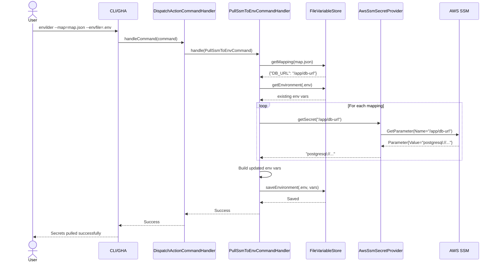
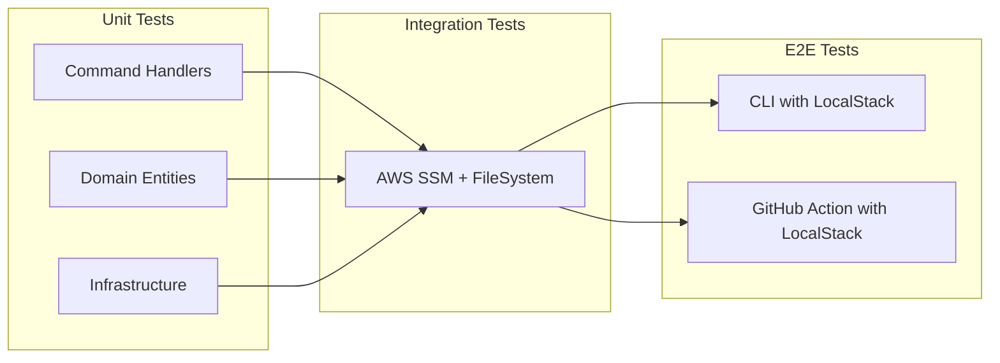

```mermaid
flowchart TB

%% ==== STYLES ====
classDef node fill:#263238,stroke:#FFFFFF,color:#FFFFFF;

%% ================= INFRASTRUCTURE LAYER (RED BG) =================
subgraph INFRA["Infrastructure Layer"]
    direction LR
    AWS[AwsSsmSecretProvider]
    FILE[FileVariableStore]
    LOG[ConsoleLogger]
end
class AWS,FILE,LOG node
style INFRA fill:#C62828,stroke:#C62828,color:#FFFFFF

%% ================= APPLICATION LAYER (YELLOW BG) =================
subgraph APP["Application Layer"]
    direction LR
    DISPATCH[DispatchActionCommandHandler]
    PULL[PullSsmToEnv]
    PUSH[PushEnvToSsm]
    SINGLE[PushSingle]
end
class DISPATCH,PULL,PUSH,SINGLE node
style APP fill:#F9A825,stroke:#F9A825,color:#000000

%% ================= DOMAIN LAYER (GREEN BG, WITH CORE) =================
subgraph DOMAIN["Domain Layer"]
    direction LR
    PORTS[Ports / ILogger / ISecretProvider / IVariableStore]
    ERR[Domain Errors]
    ENT[Entities / EnvironmentVariable]
    CORE[Core Domain<br/>Business Rules<br/>Value Objects]
end
class PORTS,ERR,ENT,CORE node
style DOMAIN fill:#2E7D32,stroke:#2E7D32,color:#FFFFFF

%% ================= PRESENTERS + DI (BLUE BG) =================
subgraph PRESENTERS["Presenters"]
    direction LR
    CLI[CLI Application<br/>apps/cli/Cli.ts]
    GHA[GitHub Action<br/>apps/gha/GitHubAction.ts]
    DI[InversifyJS Container<br/>Dependency Injection Setup]
end
class CLI,GHA,DI node
style PRESENTERS fill:#0D47A1,stroke:#0D47A1,color:#FFFFFF

%% ================= FLOWS =================

%% Presenters → DI → App
CLI --> DI
GHA --> DI
DI --> DISPATCH

%% App → Domain
DISPATCH --> PULL
DISPATCH --> PUSH
DISPATCH --> SINGLE

PULL --> PORTS
PUSH --> PORTS
SINGLE --> PORTS

PULL --> ENT
PUSH --> ENT
SINGLE --> ENT

%% Domain → Core
PORTS --> CORE
ENT --> CORE
ERR --> CORE

%% Infra → Domain (implement ports)
PORTS -.implements.-> AWS
PORTS -.implements.-> FILE
PORTS -.implements.-> LOG
```

# 🏗️ Envilder Architecture

## Overview

Envilder is built using **Hexagonal Architecture** (Ports & Adapters) and **Clean Architecture** principles.
The goal is a codebase that is **predictable, testable, modular, and easy to extend**
(new providers, new use-cases, new infrastructures).

Envilder stays fully decoupled thanks to:

* Clear **ports**
* A focused **Application Layer**
* A pure **Domain**
* Infrastructure injected through **DI**

---

## 📐 Architecture Diagram



---

## 🎯 Layer Responsibilities

### 1. Presenters (Blue)

Entry points: CLI + GitHub Action + DI setup.

Responsibilities:

* Parse user input
* Bootstrap DI
* Invoke the application layer
* Handle top-level errors and exit codes

---

### 2. Application Layer (Yellow)

Business orchestration. No domain rules. No infrastructure.

Responsibilities:

* Execute use-cases
* Validate commands
* Coordinate domain + ports
* Route actions

Handlers:

* `DispatchActionCommandHandler`
* `PullSsmToEnvCommandHandler`
* `PushEnvToSsmCommandHandler`
* `PushSingleCommandHandler`

---

### 3. Domain Layer (Green)

Pure business logic. No external dependencies.

Contains:

* Entities and Value Objects
* Domain Errors
* Ports (interfaces)
* Core domain rules

---

### 4. Infrastructure Layer (Red)

External system adapters behind ports.

Responsibilities:

* Implement ports
* AWS SSM interaction
* File system access
* Logging and technical concerns

Components:

* `AwsSsmSecretProvider`
* `FileVariableStore`
* `ConsoleLogger`

---

## 🔄 Data Flow: Pull Operation



---

## 🔄 Data Flow: Push Operation


---

## 🧩 Dependency Injection

```ts
class Startup {
  configureServices() {
    container.bind(TYPES.DispatchActionCommandHandler)
      .to(DispatchActionCommandHandler);
    container.bind(TYPES.PullSsmToEnvCommandHandler)
      .to(PullSsmToEnvCommandHandler);
  }

  configureInfrastructure(profile?: string) {
    container.bind(TYPES.ILogger).to(ConsoleLogger);
    container.bind(TYPES.ISecretProvider).to(AwsSsmSecretProvider);
    container.bind(TYPES.IVariableStore).to(FileVariableStore);
  }
}
```

**Benefits:**

* Easy to test using mocks
* Infrastructure can be swapped without touching the app or domain
* Dependencies are explicitly declared

---

## 🧪 Testing Strategy



---

## 🔌 Extension Points

### Adding a New Secret Provider

```ts
interface ISecretProvider {
  getSecret(name: string): Promise<string | undefined>;
  setSecret(name: string, value: string): Promise<void>;
}
```

```ts
@injectable()
class HashiCorpVaultProvider implements ISecretProvider {
  async getSecret(name: string): Promise<string | undefined> {}
  async setSecret(name: string, value: string): Promise<void> {}
}
```

```ts
container.bind(TYPES.ISecretProvider).to(HashiCorpVaultProvider);
```

No changes required to application or domain layers.

---

## 🎨 Design Patterns Used

| Pattern                    | Purpose                |
| -------------------------- | ---------------------- |
| **Clean Architecture** | Layered design with ports and adapters |
| **Dependency Injection**   | Loose coupling         |
| **Command Pattern**        | Encapsulate actions    |
| **Handler Pattern**        | Execute use-cases      |
| **Repository Pattern**     | Abstract data stores   |
| **Value Object**           | Immutable domain data  |
| **Factory Method**         | Create domain commands |

---

## 📁 Project Structure

```text
src/
├── apps/                         
│   ├── cli/                      
│   │   ├── Cli.ts                
│   │   └── Startup.ts            
│   └── gha/                      
│       ├── GitHubAction.ts       
│       ├── Startup.ts            
│       └── index.ts              
│
├── envilder/                     
│   ├── application/              
│   ├── domain/                   
│   └── infrastructure/           
│
└── types.ts                      
```

---

## 🚀 Future Architecture Considerations

* Plugin system for custom secret providers
* Event publishing for notifications/webhooks

---

**Last Updated**: November 2025
**Maintainer**: Marçal Albert ([@macalbert](https://github.com/macalbert))
