# 🏗️ Envilder Architecture

## Overview

Envilder follows **Hexagonal Architecture** (Ports and Adapters) combined with **Clean Architecture**
principles, ensuring a highly maintainable, testable, and extensible codebase.

## 📐 Architecture Diagram


## 🎯 Layer Responsibilities

### 1. Entry Points (Blue)

- **CLI** (`apps/cli/`): Command-line interface using Commander.js
- **GitHub Action** (`apps/gha/`): GitHub Actions integration
- **Responsibilities**:
  - Parse user input
  - Bootstrap dependency injection container
  - Invoke application layer
  - Handle exit codes and top-level errors

### 2. Application Layer (Yellow)

- **Command Handlers**: Business logic orchestration
- **Responsibilities**:
  - Coordinate domain entities and infrastructure
  - Implement use cases (pull, push, push-single)
  - Validate input commands
  - No direct dependencies on infrastructure details

**Key Components**:

- `DispatchActionCommandHandler`: Routes to appropriate handler based on operation mode
- `PullSsmToEnvCommandHandler`: Pulls secrets from AWS SSM to `.env`
- `PushEnvToSsmCommandHandler`: Pushes `.env` to AWS SSM
- `PushSingleCommandHandler`: Pushes single key-value pair to AWS SSM

### 3. Domain Layer (Green)

- **Pure business logic**: No external dependencies
- **Responsibilities**:
  - Define domain entities (Value Objects)
  - Define ports (interfaces for infrastructure)
  - Define domain errors
  - Encapsulate business rules

**Key Components**:

- `EnvironmentVariable`: Value object representing env var
- `ILogger`, `ISecretProvider`, `IVariableStore`: Port interfaces
- `ParameterNotFoundError`, `SecretOperationError`: Domain errors

### 4. Infrastructure Layer (Purple)

- **External system adapters**: Concrete implementations
- **Responsibilities**:
  - Implement domain ports
  - Interact with AWS SDK, file system, console
  - Handle technical concerns (retries, logging, etc.)

**Key Components**:

- `AwsSsmSecretProvider`: AWS SSM integration
- `FileVariableStore`: File system operations (read/write `.env`)
- `ConsoleLogger`: Console output with colors
- `Startup`: Dependency injection configuration

## 🔄 Data Flow: Pull Operation

```mermaid
sequenceDiagram
    actor User
    participant CLI as CLI/GHA
    participant Dispatch as DispatchActionCommandHandler
    participant Pull as PullSsmToEnvCommandHandler
    participant FileStore as FileVariableStore
    participant AWS as AwsSsmSecretProvider
    participant SSM as AWS SSM

    User->>CLI: envilder --map=map.json --envfile=.env
    CLI->>Dispatch: handleCommand(command)
    Dispatch->>Pull: handle(PullSsmToEnvCommand)
    
    Pull->>FileStore: getMapping(map.json)
    FileStore-->>Pull: {"DB_URL": "/app/db-url"}
    
    Pull->>FileStore: getEnvironment(.env)
    FileStore-->>Pull: existing env vars
    
    loop For each mapping
        Pull->>AWS: getSecret("/app/db-url")
        AWS->>SSM: GetParameter(Name="/app/db-url")
        SSM-->>AWS: Parameter{Value="postgresql://..."}
        AWS-->>Pull: "postgresql://..."
    end
    
    Pull->>Pull: Build updated env vars
    Pull->>FileStore: saveEnvironment(.env, vars)
    FileStore-->>Pull: ✅ Saved
    
    Pull-->>Dispatch: ✅ Success
    Dispatch-->>CLI: ✅ Success
    CLI-->>User: ✅ Secrets pulled successfully!
```



## 🔄 Data Flow: Push Operation

```mermaid
sequenceDiagram
    actor User
    participant CLI as CLI/GHA
    participant Dispatch as DispatchActionCommandHandler
    participant Push as PushEnvToSsmCommandHandler
    participant FileStore as FileVariableStore
    participant AWS as AwsSsmSecretProvider
    participant SSM as AWS SSM

    User->>CLI: envilder --push --map=map.json --envfile=.env
    CLI->>Dispatch: handleCommand(command)
    Dispatch->>Push: handle(PushEnvToSsmCommand)
    
    Push->>FileStore: getMapping(map.json)
    FileStore-->>Push: {"DB_URL": "/app/db-url"}
    
    Push->>FileStore: getEnvironment(.env)
    FileStore-->>Push: {"DB_URL": "postgresql://..."}
    
    loop For each mapping
        Push->>AWS: setSecret("/app/db-url", "postgresql://...")
        AWS->>SSM: PutParameter(Name="/app/db-url", Value="...", Type="SecureString")
        SSM-->>AWS: ✅ Parameter updated
        AWS-->>Push: ✅ Success
    end
    
    Push-->>Dispatch: ✅ Success
    Dispatch-->>CLI: ✅ Success
    CLI-->>User: ✅ Secrets pushed successfully!
```



## 🧩 Dependency Injection

Envilder uses **InversifyJS** for dependency injection, configured in `Startup.ts`:

```typescript
// Simplified example
class Startup {
  configureServices() {
    container.bind(TYPES.DispatchActionCommandHandler)
      .to(DispatchActionCommandHandler);
    container.bind(TYPES.PullSsmToEnvCommandHandler)
      .to(PullSsmToEnvCommandHandler);
    // ...
  }

  configureInfrastructure(profile?: string) {
    container.bind(TYPES.ILogger).to(ConsoleLogger);
    container.bind(TYPES.ISecretProvider).to(AwsSsmSecretProvider);
    container.bind(TYPES.IVariableStore).to(FileVariableStore);
    // ...
  }
}
```

**Benefits**:

- ✅ Testability: Easy to inject mocks
- ✅ Flexibility: Swap implementations without changing business logic
- ✅ Maintainability: Dependencies are explicit

## 🧪 Testing Strategy


### Test Pyramid

1. **Unit Tests** (Fast, Isolated):
   - Mock all dependencies
   - Test business logic in isolation
   - Example: `PullSsmToEnvCommandHandler.test.ts`

2. **Integration Tests** (Medium):
   - Test interactions between layers
   - Use real file system, mocked AWS
   - Example: `FileVariableStore.test.ts`

3. **E2E Tests** (Slow, Comprehensive):
   - Test complete workflows
   - Use LocalStack for AWS simulation
   - Example: `cli.test.ts`, `gha.test.ts`

## 🔌 Extension Points

### Adding a New Secret Provider

1. **Define the interface** (already exists):

   ```typescript
   interface ISecretProvider {
     getSecret(name: string): Promise<string | undefined>;
     setSecret(name: string, value: string): Promise<void>;
   }
   ```

2. **Implement the adapter**:

   ```typescript
   @injectable()
   class HashiCorpVaultProvider implements ISecretProvider {
     async getSecret(name: string): Promise<string | undefined> {
       // Vault API call
     }
     async setSecret(name: string, value: string): Promise<void> {
       // Vault API call
     }
   }
   ```

3. **Register in DI container**:

   ```typescript
   container.bind(TYPES.ISecretProvider).to(HashiCorpVaultProvider);
   ```

No changes needed in application or domain layers! 🎉

## 🎨 Design Patterns Used

| Pattern | Location | Purpose |
|---------|----------|---------|
| **Hexagonal Architecture** | Overall structure | Separation of concerns |
| **Dependency Injection** | InversifyJS | Loose coupling |
| **Command Pattern** | `*Command.ts` | Encapsulate operations |
| **Handler Pattern** | `*CommandHandler.ts` | Process commands |
| **Repository Pattern** | `IVariableStore` | Abstract data access |
| **Value Object** | `EnvironmentVariable` | Immutable domain concepts |
| **Factory Method** | `DispatchActionCommand.fromCliOptions` | Object creation |

## 📁 Project Structure

```text
src/
├── apps/                         # Entry points
│   ├── cli/                      # CLI application
│   │   ├── Cli.ts                # Main CLI entry
│   │   └── Startup.ts            # DI configuration
│   └── gha/                      # GitHub Action
│       ├── GitHubAction.ts       # Main GHA entry
│       ├── Startup.ts            # DI configuration
│       └── index.ts              # Entry point
│
├── envilder/                     # Core logic
│   ├── application/              # Application layer (use cases)
│   │   ├── dispatch/             # Command dispatcher
│   │   ├── pullSsmToEnv/         # Pull operation
│   │   ├── pushEnvToSsm/         # Push operation
│   │   └── pushSingle/           # Single push operation
│   │
│   ├── domain/                   # Domain layer (business logic)
│   │   ├── EnvironmentVariable.ts
│   │   ├── OperationMode.ts
│   │   ├── CliOptions.ts
│   │   ├── errors/               # Domain errors
│   │   └── ports/                # Interfaces
│   │       ├── ILogger.ts
│   │       ├── ISecretProvider.ts
│   │       └── IVariableStore.ts
│   │
│   └── infrastructure/           # Infrastructure layer (adapters)
│       ├── aws/                  # AWS SSM adapter
│       ├── logger/               # Console logger
│       ├── variableStore/        # File system adapter
│       └── package/              # Package version reader
│
└── types.ts                      # DI type symbols
```

## 🚀 Future Architecture Considerations

### Plugin System (Planned)

```typescript
interface ISecretProviderPlugin {
  name: string;
  initialize(config: unknown): Promise<void>;
  getSecret(name: string): Promise<string | undefined>;
  setSecret(name: string, value: string): Promise<void>;
}

// Users could provide custom plugins:
// envilder --provider=vault --provider-config=vault.json
```

### Event System (Planned)

```typescript
interface IEventPublisher {
  publish(event: DomainEvent): Promise<void>;
}

// Enable notifications (Slack, webhooks) on secret changes
```

## 📚 Further Reading

- [Hexagonal Architecture](https://alistair.cockburn.us/hexagonal-architecture/)
- [Clean Architecture (Uncle Bob)](https://blog.cleancoder.com/uncle-bob/2012/08/13/the-clean-architecture.html)
- [Dependency Injection in TypeScript](https://github.com/inversify/InversifyJS)
- [Domain-Driven Design](https://martinfowler.com/bliki/DomainDrivenDesign.html)

---

**Last Updated**: November 2025  
**Maintainer**: Marçal Albert ([@macalbert](https://github.com/macalbert))
