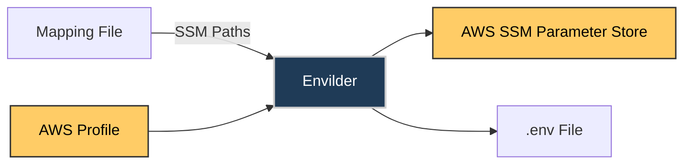

# Envilder: Pull Command

## Overview

The pull command downloads secrets from AWS SSM Parameter Store and writes them to a local `.env` file using a mapping file.


## Pull Mode

Download secrets from AWS SSM and generate a local `.env` file using a mapping JSON.

### How Pull Mode Works



**Example:**
If your `param-map.json` file contains:

```json
{
  "API_KEY": "/myapp/api/key",
  "DB_PASSWORD": "/myapp/db/password",
  "SECRET_TOKEN": "/myapp/auth/token"
}
```

Running this command:

```bash
envilder --map=param-map.json --envfile=.env
```

With profile:

```bash
envilder --map=param-map.json --envfile=.env --profile=dev-account
```

**Sample Output:**

```dotenv
# Generated by Envilder on 2025-07-13
API_KEY=abc123
DB_PASSWORD=secret456
SECRET_TOKEN=eyJhbGciOiJIUzI1NiIsInR5cCI6IkpXVCJ9
```

### Pull Mode Options

| Option      | Description                         |
| ----------- | ----------------------------------- |
| `--map`     | JSON mapping of env var to SSM path |
| `--envfile` | Path to write `.env`                |
| `--profile` | AWS profile to use                  |

### Pull Mode Examples

```bash
envilder --map=param-map.json --envfile=.env
```

With profile:

```bash
envilder --map=param-map.json --envfile=.env --profile=dev-account
```

**Other environment examples:**

```bash
# Default
envilder --map=param-map.json --envfile=.env.dev
# Development
envilder --map=param-map.json --envfile=.env.dev --profile=dev-account
# Production
envilder --map=param-map.json --envfile=.env.prod --profile=prod-account
```

## Notes

- Only variables defined in the mapping file are pulled.
- Use the `--profile` flag to select AWS credentials.
- No secrets are exposed in code or version control.
