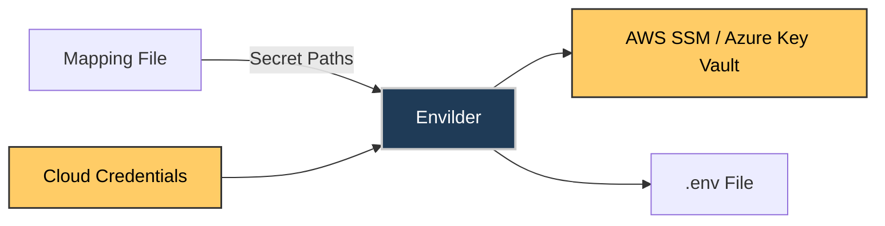

# Envilder: Pull Command

## Overview

The pull command downloads secrets from your cloud provider (AWS SSM Parameter Store or Azure Key Vault)
and writes them to a local `.env` file using a mapping file.


## Pull Mode

Download secrets from your cloud provider and generate a local `.env` file using a mapping JSON.

### How Pull Mode Works


```mermaid
graph LR
    A[Mapping File] --> |Secret Paths| B[Envilder]:::core
    D[Cloud Credentials]:::cloud --> B
    B --> E[AWS SSM / Azure Key Vault]:::cloud
    B --> F[.env File]

    classDef cloud fill:#ffcc66,color:#000000,stroke:#333,stroke-width:1.5px;
    classDef core fill:#1f3b57,color:#fff,stroke:#ccc,stroke-width:2px;
```

**Example:**
If your `param-map.json` file contains:

> 📖 See [Mapping File Format](../README.md#️-mapping-file-format) for the full reference on `$config` and provider options.

```json
{
  "API_KEY": "/myapp/api/key",
  "DB_PASSWORD": "/myapp/db/password",
  "SECRET_TOKEN": "/myapp/auth/token"
}
```

Running this command:

```bash
envilder --map=param-map.json --envfile=.env
```

With profile:

```bash
envilder --map=param-map.json --envfile=.env --profile=dev-account
```

**Sample Output:**

```dotenv
# Generated by Envilder on 2025-07-13
API_KEY=abc123
DB_PASSWORD=secret456
SECRET_TOKEN=eyJhbGciOiJIUzI1NiIsInR5cCI6IkpXVCJ9
```

### Pull Mode Options

| Option        | Description                                                        |
| ------------- | ------------------------------------------------------------------ |
| `--map`       | JSON mapping of env var to secret path                             |
| `--envfile`   | Path to write `.env`                                               |
| `--provider`  | Cloud provider: `aws` (default) or `azure` (overrides `$config`)   |
| `--vault-url` | Azure Key Vault URL (overrides `$config.vaultUrl` in map file)     |
| `--profile`   | AWS profile to use (overrides `$config.profile`)                   |

> **Azure:** Provide the vault URL via `$config.vaultUrl` in your map file or use `--vault-url`.
> CLI flags (`--provider`, `--vault-url`, `--profile`) override `$config` values in the map file.

### Pull Mode Examples

**AWS SSM (default):**

```bash
envilder --map=param-map.json --envfile=.env
```

With profile:

```bash
envilder --map=param-map.json --envfile=.env --profile=dev-account
```

**Azure Key Vault (via `$config` in map file):**

Add `$config` to your map file:

```json
{
  "$config": {
    "provider": "azure",
    "vaultUrl": "https://my-vault.vault.azure.net"
  },
  "API_KEY": "myapp-prod-api-key",
  "DB_PASSWORD": "myapp-prod-db-password"
}
```

Then pull as usual:

```bash
envilder --map=param-map.json --envfile=.env
```

**Azure Key Vault (via CLI flags):**

```bash
envilder --provider=azure --vault-url=https://my-vault.vault.azure.net --map=param-map.json --envfile=.env
```

**Other environment examples:**

```bash
# Default
envilder --map=param-map.json --envfile=.env.dev
# Development
envilder --map=param-map.json --envfile=.env.dev --profile=dev-account
# Production
envilder --map=param-map.json --envfile=.env.prod --profile=prod-account
# Azure (using $config in map file)
envilder --map=azure-param-map.json --envfile=.env.prod
# Azure (using CLI flags)
envilder --provider=azure --vault-url=https://prod-vault.vault.azure.net --map=param-map.json --envfile=.env.prod
```

## Notes

- Only variables defined in the mapping file are pulled.
- Use the `--provider` flag or `$config.provider` in the map file to switch between AWS and Azure.
- Use the `--vault-url` flag or `$config.vaultUrl` in the map file for Azure Key Vault URL.
- Use the `--profile` flag or `$config.profile` to select AWS credentials.
- CLI flags override `$config` values: `--provider` > `$config.provider`, `--vault-url` > `$config.vaultUrl`,
`--profile` > `$config.profile`.
- No secrets are exposed in code or version control.

> **Permissions:** Your cloud identity must have read access to secrets.
> See [Set Up IAM Permissions](requirements-installation.md#4-set-up-iam-permissions) for AWS and Azure setup.
