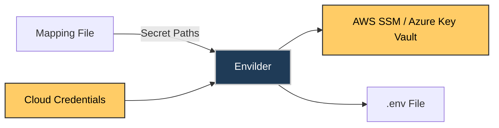

# Envilder: Pull Command

## Overview

The pull command downloads secrets from your cloud provider (AWS SSM Parameter Store or Azure Key Vault)
and writes them to a local `.env` file using a mapping file.


## Pull Mode

Download secrets from your cloud provider and generate a local `.env` file using a mapping JSON.

### How Pull Mode Works


```mermaid
graph LR
    A[Mapping File] --> |Secret Paths| B[Envilder]:::core
    D[Cloud Credentials]:::cloud --> B
    B --> E[AWS SSM / Azure Key Vault]:::cloud
    B --> F[.env File]

    classDef cloud fill:#ffcc66,color:#000000,stroke:#333,stroke-width:1.5px;
    classDef core fill:#1f3b57,color:#fff,stroke:#ccc,stroke-width:2px;
```

**Example:**
If your `param-map.json` file contains:

```json
{
  "API_KEY": "/myapp/api/key",
  "DB_PASSWORD": "/myapp/db/password",
  "SECRET_TOKEN": "/myapp/auth/token"
}
```

Running this command:

```bash
envilder --map=param-map.json --envfile=.env
```

With profile:

```bash
envilder --map=param-map.json --envfile=.env --profile=dev-account
```

**Sample Output:**

```dotenv
# Generated by Envilder on 2025-07-13
API_KEY=abc123
DB_PASSWORD=secret456
SECRET_TOKEN=eyJhbGciOiJIUzI1NiIsInR5cCI6IkpXVCJ9
```

### Pull Mode Options

| Option       | Description                                              |
| ------------ | -------------------------------------------------------- |
| `--map`      | JSON mapping of env var to secret path                   |
| `--envfile`  | Path to write `.env`                                     |
| `--provider` | Cloud provider: `aws` (default) or `azure`               |
| `--profile`  | AWS profile to use (AWS only)                            |

> **Azure:** Set the `AZURE_KEY_VAULT_URL` environment variable when using `--provider=azure`.

### Pull Mode Examples

**AWS SSM (default):**

```bash
envilder --map=param-map.json --envfile=.env
```

With profile:

```bash
envilder --map=param-map.json --envfile=.env --profile=dev-account
```

**Azure Key Vault:**

```bash
export AZURE_KEY_VAULT_URL=https://my-vault.vault.azure.net
envilder --provider=azure --map=param-map.json --envfile=.env
```

**Other environment examples:**

```bash
# Default
envilder --map=param-map.json --envfile=.env.dev
# Development
envilder --map=param-map.json --envfile=.env.dev --profile=dev-account
# Production
envilder --map=param-map.json --envfile=.env.prod --profile=prod-account
# Azure
export AZURE_KEY_VAULT_URL=https://prod-vault.vault.azure.net
envilder --provider=azure --map=param-map.json --envfile=.env.prod
```

## Notes

- Only variables defined in the mapping file are pulled.
- Use the `--provider` flag to switch between AWS and Azure.
- Use the `--profile` flag to select AWS credentials (AWS only).
- For Azure, set the `AZURE_KEY_VAULT_URL` environment variable.
- No secrets are exposed in code or version control.
