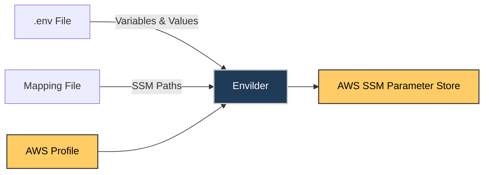
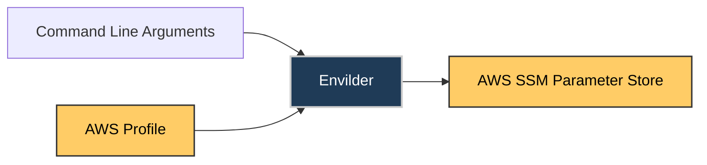

# Envilder: Push Command

## Overview

The push command uploads environment variables from a local `.env` file to AWS SSM Parameter Store using a mapping file.


## Usage

```bash
envilder --push --envfile=.env --map=param-map.json
```

### With AWS Profile

```bash
envilder --push --envfile=.env.prod --map=param-map.json --profile=prod-account
```

## Mapping File Example (`param-map.json`)

```json
{
  "API_KEY": "/myapp/api/key",
  "DB_PASSWORD": "/myapp/db/password"
}
```

## .env File Example

```dotenv
API_KEY=abc123
DB_PASSWORD=secret456
```

## What Happens

- Each variable found in both `.env` and mapping file is pushed to the corresponding SSM path.
- No files are modified locally.
- Use the `--profile` flag for different AWS accounts.

## Push Mode

Sync your local `.env` variables to AWS SSM using a mapping file and mapping JSON.

### How File-Based Push Works



**Example:**
If your `.env` file contains:

```text
API_KEY=abc123
DB_PASSWORD=secret456
```

And your `param-map.json` file contains:

```json
{
  "API_KEY": "/myapp/api/key",
  "DB_PASSWORD": "/myapp/db/password"
}
```

Running this command:

```bash
envilder --push --envfile=.env --map=param-map.json
```

Will push:

- Value `abc123` to SSM path `/myapp/api/key`
- Value `secret456` to SSM path `/myapp/db/password`

### Single Variable Push

Push a single environment variable directly to AWS SSM Parameter Store without using any files.



**Example:**

```bash
envilder --push --key=API_KEY --value=abc123 --ssm-path=/myapp/api/key
```

Will push:

- Value `abc123` to SSM path `/myapp/api/key`

### Push Mode Options

| Option       | Description                        |
|------------- | ---------------------------------- |
| `--push`     | Required: Enables push mode        |
| `--profile`  | Optional: AWS CLI profile to use   |
| `--envfile`  | Required: Path to your local .env file             |
| `--map`      | Required: Path to your parameter mapping JSON file |

### Push Single Mode Options

| Option       | Description                        |
|------------- | ---------------------------------- |
| `--push`     | Required: Enables push mode        |
| `--profile`  | Optional: AWS CLI profile to use   |
| `--key`      | Required: Environment variable name         |
| `--value`    | Required: Value to store in AWS SSM         |
| `--ssm-path` | Required: Full SSM parameter path           |

### Push Mode Examples

**Push from .env file (multiple variables):**

```bash
envilder --push --envfile=.env --map=param-map.json
```

With AWS profile:

```bash
envilder --push --envfile=.env.prod --map=param-map.json --profile=prod-account
```

**Single variable push:**

```bash
envilder --push --key=API_KEY --value=secret123 --ssm-path=/my/path
```

With AWS profile:

```bash
envilder --push --key=API_KEY --value=secret123 --ssm-path=/my/path --profile=dev
```
