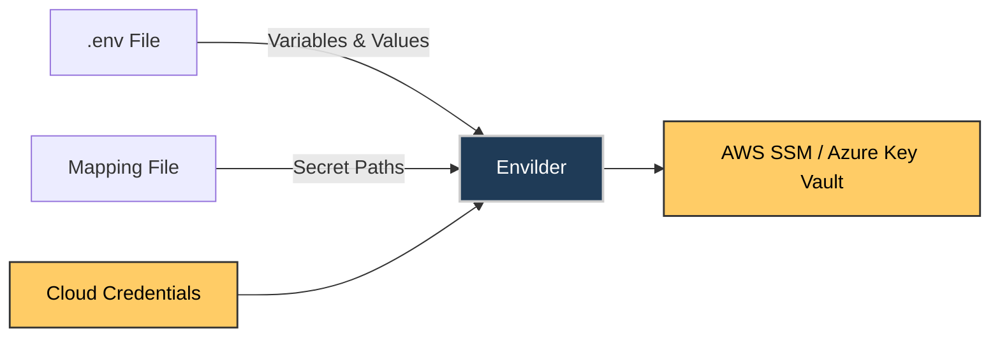
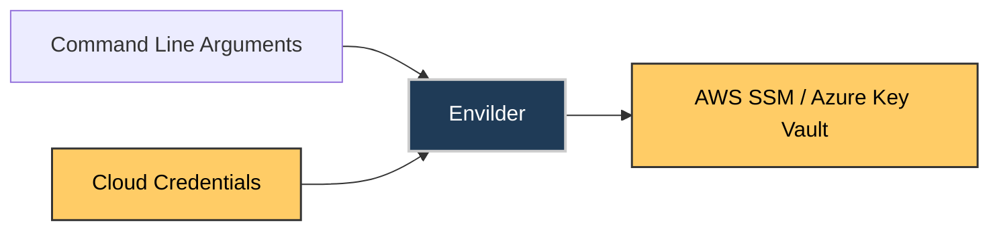

# Envilder: Push Command

## Overview

The push command uploads environment variables from a local `.env` file to your cloud provider (AWS SSM Parameter Store
or Azure Key Vault) using a mapping file.


## Usage

```bash
# Zero-config: uses envilder.json and .env by default
envilder --push
```

With explicit paths:

```bash
envilder --push --envfile=.env --map=envilder.json
```

### With AWS Profile

```bash
envilder --push --envfile=.env.prod --map=envilder.json --profile=prod-account
```

## Mapping File Example (`envilder.json`)

> 📖 See [Mapping File Format](../README.md#️-mapping-file-format) for the full reference on `$config` and provider options.

### AWS SSM (default)

```json
{
  "$schema": "https://envilder.com/schema/map-file.v1.json",
  "API_KEY": "/myapp/api/key",
  "DB_PASSWORD": "/myapp/db/password"
}
```

### Azure Key Vault (via `$config`)

Add `$config` to your map file to target Azure Key Vault:

```json
{
  "$schema": "https://envilder.com/schema/map-file.v1.json",
  "$config": {
    "provider": "azure",
    "vaultUrl": "https://my-vault.vault.azure.net"
  },
  "API_KEY": "myapp-prod-api-key",
  "DB_PASSWORD": "myapp-prod-db-password"
}
```

> CLI flags (`--provider`, `--vault-url`, `--profile`) override `$config` values in the map file.

## .env File Example

```dotenv
API_KEY=abc123
DB_PASSWORD=secret456
```

## What Happens

- Each variable found in both `.env` and mapping file is pushed to the corresponding secret path.
- No files are modified locally.
- Use `--provider=azure` or `$config.provider` in the map file to push to Azure Key Vault instead of AWS SSM.
- Use the `--vault-url` flag or `$config.vaultUrl` for the Azure Key Vault URL.
- Use the `--profile` flag for different AWS accounts (AWS only).

> **Permissions:** Your cloud identity must have write access to secrets.
> See [Set Up IAM Permissions](requirements-installation.md#4-set-up-iam-permissions) for AWS and Azure setup.

## Push Mode

Sync your local `.env` variables to your cloud provider using a mapping file and mapping JSON.

### How File-Based Push Works


```mermaid
graph LR
  A[.env File] --> |Variables & Values| B[Envilder]:::core
  C[Mapping File] --> |Secret Paths| B
  D[Cloud Credentials]:::cloud --> B
  B --> E[AWS SSM / Azure Key Vault]:::cloud

  classDef cloud fill:#ffcc66,color:#000000,stroke:#333,stroke-width:1.5px;
  classDef core fill:#1f3b57,color:#fff,stroke:#ccc,stroke-width:2px;
```

**Example:**
If your `.env` file contains:

```text
API_KEY=abc123
DB_PASSWORD=secret456
```

And your `envilder.json` file contains:

```json
{
  "$schema": "https://envilder.com/schema/map-file.v1.json",
  "API_KEY": "/myapp/api/key",
  "DB_PASSWORD": "/myapp/db/password"
}
```

Running this command (uses `envilder.json` and `.env` by default):

```bash
envilder --push
```

Or with explicit paths:

```bash
envilder --push --envfile=.env --map=envilder.json
```

Will push:

- Value `abc123` to SSM path `/myapp/api/key`
- Value `secret456` to SSM path `/myapp/db/password`

### Single Variable Push

Push a single environment variable directly to your cloud provider without using a `.env` file.

> **Provider resolution:** If an `envilder.json` exists in the current directory, its `$config`
> section (`provider`, `vaultUrl`, `profile`) is read and applied so the single push targets the
> same provider as the rest of your project. The resolved provider is logged before the push.
> When no `envilder.json` is present, AWS SSM is used unless you pass `--provider`. CLI flags always
> override `$config`.


```mermaid
graph LR
  A[Command Line Arguments] --> B[Envilder]:::core
  C[Cloud Credentials]:::cloud --> B
  B --> D[AWS SSM / Azure Key Vault]:::cloud

  classDef cloud fill:#ffcc66,color:#000000,stroke:#333,stroke-width:1.5px;
  classDef core fill:#1f3b57,color:#fff,stroke:#ccc,stroke-width:2px;  
```

**Example:**

```bash
envilder --push --key=API_KEY --value=abc123 --secret-path=/myapp/api/key
```

Will push:

- Value `abc123` to secret path `/myapp/api/key`

When an `envilder.json` with an Azure `$config` is present in the current directory, the same command
targets Azure Key Vault automatically (logged as `Using configuration from envilder.json: provider=azure, ...`).
Pass `--provider`/`--vault-url` to override.

### Push Mode Options

| Option        | Description                                                |
|-------------- | ---------------------------------------------------------- |
| `--push`      | Required: Enables push mode                                |
| `--provider`  | Optional: Cloud provider `aws` (default) or `azure`        |
| `--vault-url` | Optional: Azure Key Vault URL (overrides `$config.vaultUrl`)|
| `--profile`   | Optional: AWS CLI profile to use (AWS only)                |
| `--envfile`   | Optional: Path to your local .env file (default: `.env`)   |
| `--map`       | Optional: Path to your parameter mapping JSON file (default: `envilder.json`) |

### Push Single Mode Options

| Option        | Description                                                |
|-------------- | ---------------------------------------------------------- |
| `--push`      | Required: Enables push mode                                |
| `--provider`  | Optional: Cloud provider `aws` (default) or `azure`        |
| `--vault-url` | Optional: Azure Key Vault URL (overrides `$config.vaultUrl`)|
| `--profile`   | Optional: AWS CLI profile to use (AWS only)                |
| `--key`      | Required: Environment variable name                        |
| `--value`    | Required: Value to store in your cloud provider            |
| `--secret-path` | Required: Full secret path in your cloud provider       |
| `--map`       | Optional: Map file to read `$config` from (default: `envilder.json` if present; never required for single push) |

### Push Mode Examples

**Push from .env file (multiple variables, zero-config):**

```bash
envilder --push
```

With explicit paths:

```bash
envilder --push --envfile=.env --map=envilder.json
```

With AWS profile:

```bash
envilder --push --envfile=.env.prod --map=envilder.json --profile=prod-account
```

**Azure Key Vault (via `$config` in map file):**

```bash
envilder --push --envfile=.env --map=envilder.azure.json
```

**Azure Key Vault (via CLI flags):**

```bash
envilder --push --provider=azure --vault-url=https://my-vault.vault.azure.net --envfile=.env --map=envilder.json
```

**Single variable push:**

```bash
envilder --push --key=API_KEY --value=secret123 --secret-path=/my/path
```

With AWS profile:

```bash
envilder --push --key=API_KEY --value=secret123 --secret-path=/my/path --profile=dev
```
